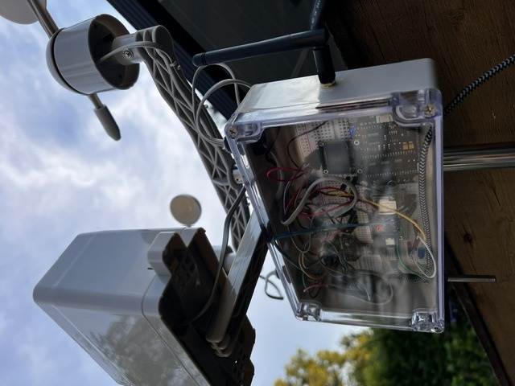
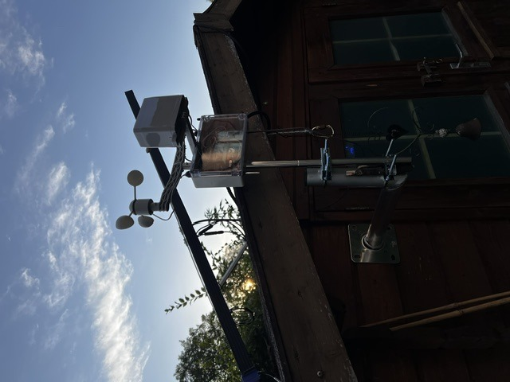

# IceWeatherstation

DIY-Wetterstation auf Basis **ESP32 + Tasmota**: Temperatur, Luftfeuchte, Luftdruck, eine wasserdichte Zusatz-Temperatursonde, Wind (Geschwindigkeit + Richtung), Regenmenge, **Blitzerkennung** (AS3935/Franklin-Sensor) und ein **kalibrierter dBA-Schallpegelmesser**.

## Warum dieses Projekt?

Basiert auf dem Konzept des [ampheo.com Blog-Artikels "How to build a smart weather station with sensors"](https://www.ampheo.com/blog/how-to-build-a-smart-weather-station-with-sensors), erweitert um:

- **Franklin-Blitzsensor** (AS3935) für Blitzerkennung inkl. grober Entfernungsschätzung
- **Kalibriertes dBA-Schallpegelmodul** (DFRobot Gravity SEN0232, 30–130 dBA, A-bewertet) statt eines unkalibrierten Mikrofons, mit wetterfestem Mikrofongehäuse nach dem bewährten [DNMS-Design](https://sensor.community/en/sensors/dnms/) des sensor.community-Citizen-Science-Projekts
- **Zwingend externe WLAN-Antenne** — ESP32-WROOM-32U/32UE-Modulvariante statt der üblichen PCB-Antenne
- **100% Tasmota-Firmware** statt Arduino/PlatformIO, inklusive eigenständigem Web-UI, das komplett ohne Home Assistant/MQTT funktioniert (für Geräte ohne Smart-Home-Infrastruktur beim Empfänger)

Ursprünglich war angedacht, günstige Fertigsensorik (MISOL "Spare Part Outdoor Unit") zu verwenden — siehe [docs/misol-compatibility.md](docs/misol-compatibility.md), warum das **nicht** ohne Weiteres plug-and-play funktioniert und welche zwei Wege es trotzdem gäbe.

## Status

✅ **Erstes Gerät aufgebaut, geflasht und am Schuppen im Betrieb (Stand 2026-07-19).** DS18B20, Regenmesser, Anemometer, Windfahne, dBA-Sensor, AS3935 (Blitz) und OLED-Display sind verkabelt, kalibriert und live verifiziert; MQTT + Home-Assistant-Anbindung läuft. Noch offen: BME280 (Temperatur/Feuchte/Druck) ist bestellt, aber noch nicht geliefert/verbaut. Zweites Gerät (fürs Geschenk) folgt nach demselben Bauplan.

Fotos vom fertigen Aufbau:

  
  

Es sind **zwei Geräte** geplant (baugleich): eines für den Eigenbedarf, eines als Geschenk. Das zweite Gerät ist bewusst so ausgelegt, dass es **ohne** Home Assistant/MQTT beim Empfänger funktioniert — die Sensorwerte sind direkt über Tasmotas eingebautes Web-UI abrufbar.

## Struktur

| Datei | Inhalt |
|---|---|
| [docs/setup-guide.md](docs/setup-guide.md) | **Schritt-für-Schritt-Anleitung**: Aufbau, Flashen, Konfiguration, Home-Assistant-Einbindung, WebGUI |
| [docs/bom.md](docs/bom.md) | Vollständige Teileliste mit Bezugsquellen |
| [docs/wiring.md](docs/wiring.md) | Pinbelegung + Verkabelungskonzept (Diagramm) |
| [docs/enclosure.md](docs/enclosure.md) | Gehäuse, Mast-Montage, wetterfestes Mikrofongehäuse (DNMS-Design) |
| [docs/misol-compatibility.md](docs/misol-compatibility.md) | MISOL-Kompatibilitätsanalyse (warum kein Plug-and-Play) |
| [docs/tasmota-config.md](docs/tasmota-config.md) | Firmware-Konfiguration: Template, Counter, ADC, Rules |
| [firmware/README.md](firmware/README.md) | Firmware-Bezug: eigener Custom-Build nötig (AS3935 + OLED-Display sind in keinem offiziellen ESP32-Release kombiniert), inkl. `custom-build/`-Patches + Flash-/OTA-Anleitung |
| [firmware/config/backlog.txt](firmware/config/backlog.txt) | Fertiger Tasmota-Konsolen-Befehlssatz (Counter, ADC, AS3935) |
| [firmware/berry/autoexec.be](firmware/berry/autoexec.be) | Berry-Skript-Entwurf: Windrichtung-Lookup + Web-UI-Erweiterung |

## Hardware-Kurzüberblick

| Sensor | Bauteil | Werte |
|---|---|---|
| Temp/Feuchte/Druck | Bosch BME280 (I2C) | °C, %rH, hPa |
| Zusatz-Temperatur | DS18B20 (wasserdicht, 1-Wire) | °C |
| Wind | SparkFun Weather Meter Kit SEN-15901 | km/h, Richtung (8-stufig) |
| Regen | SparkFun Weather Meter Kit SEN-15901 | mm (Kippwaage) |
| Blitz | AS3935 / CJMCU-3935 (I2C) | Ereignis, Distanz (km), Energie |
| Schallpegel | DFRobot Gravity SEN0232 (analog) | dBA, 30–130 dB, A-bewertet |

Details siehe [docs/bom.md](docs/bom.md) und [docs/wiring.md](docs/wiring.md).

## Quellen / Credits

- [ampheo.com Blog](https://www.ampheo.com/blog/how-to-build-a-smart-weather-station-with-sensors) — Grundkonzept
- [SparkFun Weather Meter Kit SEN-15901 Hookup Guide](https://learn.sparkfun.com/tutorials/weather-meter-hookup-guide) — Wind/Regen-Sensorik
- [DFRobot Gravity SEN0232 Wiki](https://wiki.dfrobot.com/Gravity_Analog_Sound_Level_Meter_SKU_SEN0232) — dBA-Kalibrierung
- [sensor.community DNMS-Projekt](https://sensor.community/en/sensors/dnms/) — Wetterschutzgehäuse-Design fürs Mikrofon
- [rtl_433 Projekt](https://github.com/merbanan/rtl_433) — `fineoffset.c`-Decoder, Grundlage der MISOL-Kompatibilitätsanalyse
- [Tasmota-Dokumentation](https://tasmota.github.io/docs/) — Firmware-Referenz

## Lizenz

MIT, siehe [LICENSE](LICENSE). Keine Gewähr — insbesondere die Firmware-Beispiele sind unkalibrierte Entwürfe, siehe Status oben.
