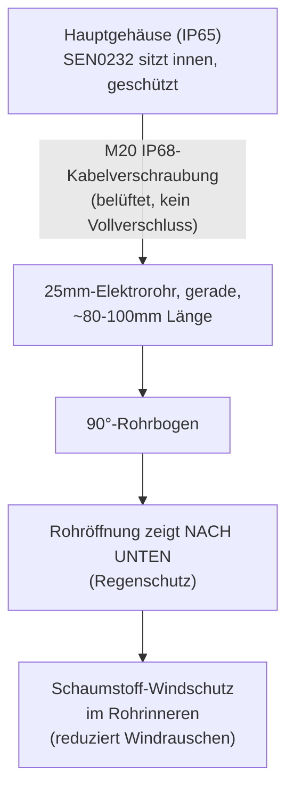
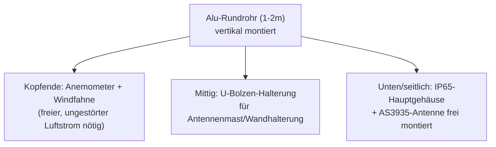

# Gehäuse & Wetterschutz

## Hauptgehäuse

IP65-Elektronikgehäuse (Polycarbonat oder ABS, ~200×120×75mm) nimmt ESP32, BME280, AS3935, SEN0232 und die Verkabelung auf. Kabelverschraubungen (IP68) für:

- Wetterkabel-Bündel zu Anemometer/Windfahne/Regenmesser (SEN-15901, RJ11-Anschlüsse)
- DS18B20-Sonde
- Stromzuleitung
- Mikrofonrohr (siehe unten) — **hier keine dichte Verschraubung**, sondern eine belüftete Lösung

Ein Silikagel-Beutel im Gehäuse reduziert Kondenswasserbildung bei Temperaturwechseln.

## Wetterschutz für das dBA-Mikrofon (DNMS-Design)

Das SEN0232-Mikrofon braucht Zugang zur Außenluft, muss aber vor Regen und Windrauschen geschützt werden. Bewährtes Design aus dem [DNMS-Projekt](https://sensor.community/en/sensors/dnms/) von sensor.community: ein kurzes Elektroinstallationsrohr mit 90°-Bogen, Öffnung nach unten, mit Schaumstoff-Windschutz im Inneren.

**Warum diese Reihenfolge wichtig ist:**

1. **Öffnung nach unten** — verhindert, dass Regen direkt ins Rohr und zum Mikrofon läuft
2. **Schaumstoff im Inneren** — laut DNMS-Dokumentation "absolut notwendig", da Windrauschen sonst die dB-Messung verfälscht (Böen erzeugen tieffrequentes Rauschen, das die A-Bewertung nicht korrekt herausfiltert)
3. **SEN0232 bleibt im Hauptgehäuse** — nur die akustische Öffnung ragt nach außen, das Sensor-Modul selbst bleibt trocken

## Mast-Montage

**Montage-Hinweise:**
- Anemometer und Windfahne so hoch wie möglich, frei von Turbulenzen durch Gebäude/Bäume
- AS3935 reagiert empfindlich auf EMI — Antenne/Sensor nicht direkt neben Stromkabeln oder Metallmasten platzieren
- Regenmesser (Kippwaage) muss exakt waagerecht montiert sein, sonst systematischer Messfehler — mit Wasserwaage ausrichten

Weiter mit: [tasmota-config.md](tasmota-config.md) oder zurück zum [setup-guide.md](setup-guide.md) für die Gesamt-Reihenfolge.
