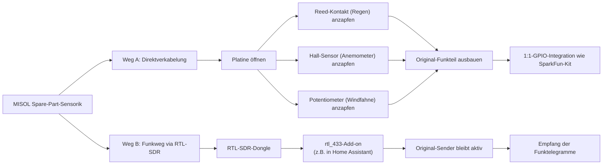

# Warum keine MISOL-Fertigsensorik?

Ursprünglich stand zur Debatte, günstige Fertigsensorik von MISOL ("Spare Part Outdoor Unit für professionelle Funk-Wetterstationen") statt des SparkFun Weather Meter Kits zu verwenden — deutlich günstiger, aber mit einem entscheidenden Unterschied im Funktionsprinzip.

## Das Problem

Die MISOL-Sensorik (Wind/Regen/Temp/Feuchte) ist **keine** einfache GPIO-Sensorik wie im ampheo.com-Blog-Artikel beschrieben, sondern die komplette Sensorik einer **fertigen 433-MHz-Funk-Wetterstation**. Laut Quellcode des [rtl_433-Projekts](https://github.com/merbanan/rtl_433) (`fineoffset.c`-Decoder) ist die Hardware mit hoher Wahrscheinlichkeit **Fine-Offset/WH65-kompatibel** und wird dort explizit als "Misol WS2320" gelistet.

Der Hersteller garantiert selbst **keine** Kompatibilität zu Fremdgeräten — die Sensorik ist dafür gebaut, an den mitgelieferten Funkempfänger zu senden, nicht für einen direkten GPIO-Anschluss an einen Mikrocontroller wie den ESP32.

## Zwei mögliche Wege, falls MISOL trotzdem gewünscht ist

Keiner davon ist "plug and play":

| Weg | Aufwand | Bewertung |
|---|---|---|
| **A. Direktverkabelung** | Löten/Basteln (Platine öffnen, Original-Funkteil ausbauen, Reed-/Hall-/Potentiometer-Signale direkt anzapfen), danach 1:1-GPIO-Integration wie beim SparkFun-Kit | Mehrfach von anderen Bastlern für baugleiche Fine-Offset-Sensorik dokumentiert (z.B. [github.com/pilotak/WeatherMeters](https://github.com/pilotak/WeatherMeters), diverse Home-Assistant-Community-Threads). Funktioniert nachweislich für ähnliche Hardware, aber nicht für jede MISOL-SKU einzeln belegt |
| **B. Funkweg via RTL-SDR** | Kein Löten, aber zusätzliche Hardware (SDR-Dongle) + separater Empfangspfad, z.B. über eine Home-Assistant-Integration | Protokoll-Kompatibilität sehr wahrscheinlich (Fine-Offset-Protokollfamilie ist in `rtl_433` gut dokumentiert), aber nicht 1:1 für jede konkrete SKU verifiziert |

## Warum stattdessen SparkFun SEN-15901

Das [SparkFun Weather Meter Kit](https://www.sparkfun.com/weather-meter-kit.html) ist zwar teurer, aber:

- Dokumentierte, offene GPIO-Schnittstelle (Reed-Kontakte + Potentiometer direkt über RJ11-Kabel)
- Offizieller [Hookup Guide](https://learn.sparkfun.com/tutorials/weather-meter-hookup-guide) mit exakten Umrechnungsformeln
- Kein Löt-/Bastelrisiko, "aus der Tüte funktionierend"

**Wichtig bei beiden Wegen (MISOL wie SparkFun):** Die Windfahne braucht in der Praxis eine manuelle Kalibrierung — die Datenblattwerte stimmen laut mehreren Quellen nicht exakt mit der real gemessenen Spannung überein.

Zurück zur [Teileliste](bom.md).
