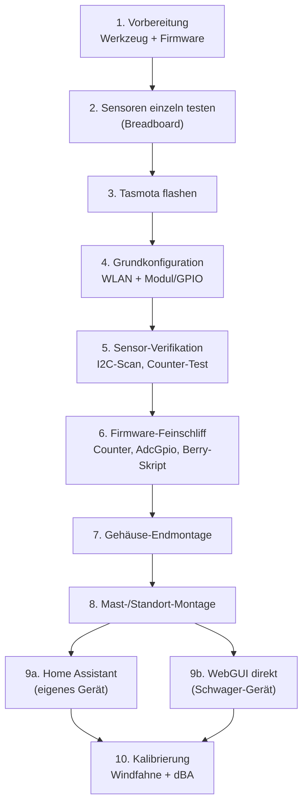
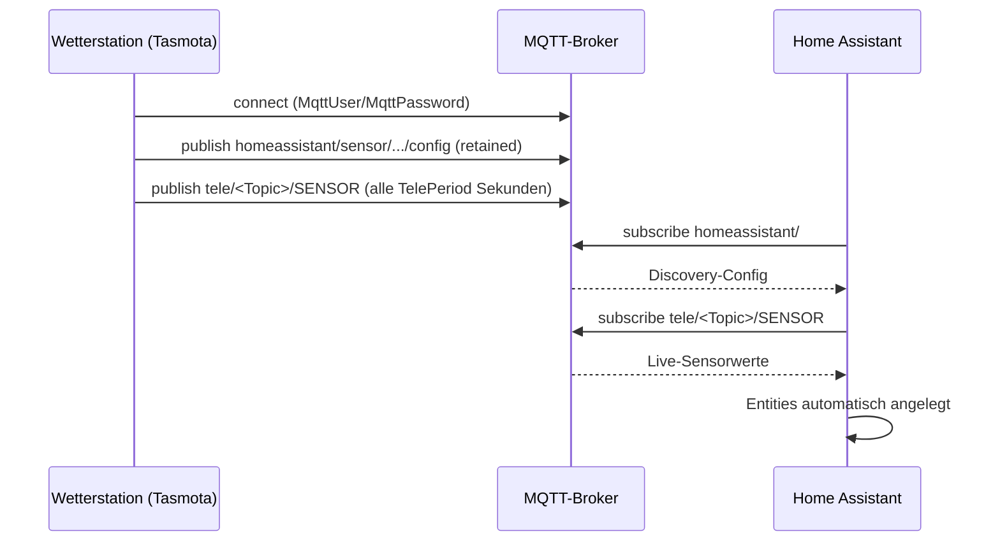

# Setup-Guide: Aufbau, Installation, Konfiguration, Integration

Schritt-für-Schritt-Anleitung für den kompletten Weg von den einzelnen Bauteilen bis zur fertig eingebundenen Wetterstation. Gilt für beide Geräte — beim zweiten Gerät (ohne Home Assistant beim Empfänger) einfach Schritt 8 überspringen.



## 1. Vorbereitung

- Werkzeug: Lötkolben, Multimeter, Wasserwaage (für Regenmesser-Montage), Schraubendreher-Set
- Tasmota-Firmware: aktuelle ESP32-Version von [tasmota.github.io](https://tasmota.github.io/docs/) herunterladen (Standard-Build reicht, kein Custom-Build nötig — anders als bei den MAX7219-Matrix-Displays)
- [Tasmotizer](https://github.com/tasmota/tasmotizer) oder `esptool.py` zum Flashen
- Diese Doku griffbereit: [bom.md](bom.md) (Teile), [wiring.md](wiring.md) (Pins), [tasmota-config.md](tasmota-config.md) (Befehle)

## 2. Sensoren einzeln auf dem Breadboard testen

**Vor** dem Verlöten/Einbau ins Gehäuse jeden Sensor einzeln gegen den ESP32 testen — spart bei einem Fehler das erneute Öffnen des fertigen Gehäuses:

1. BME280 per I2C anschließen (SDA/SCL wie in [wiring.md](wiring.md))
2. AS3935 dazu auf denselben I2C-Bus (Adresse ggf. abweichend vom Klon — siehe Luft1-Erfahrungswert `0x03`)
3. DS18B20 an GPIO4 mit 4,7 kΩ Pull-up
4. SEN-15901-Kabelbaum: Regen/Wind/Windfahne einzeln nach RJ11-Pinbelegung (siehe [SparkFun Hookup Guide](https://learn.sparkfun.com/tutorials/weather-meter-hookup-guide))
5. SEN0232 (dBA) an ADC1-Pin

## 3. Tasmota flashen

Über USB per Tasmotizer oder `esptool.py write_flash`. Nach dem ersten Boot verbindet sich der ESP32 als offener Access Point (`tasmota-XXXX`) — darüber die WLAN-Zugangsdaten eintragen.

> Platzhalter in dieser Anleitung: `<WIFI_SSID>` / `<WIFI_PASSWORT>` / `<MQTT_BROKER>` / `<MQTT_USER>` / `<MQTT_PASSWORT>` — bewusst nicht mit echten Zugangsdaten befüllt, durch eigene Werte ersetzen.

## 4. Grundkonfiguration

1. *Konfiguration* → *Konfiguriere WLAN*: `<WIFI_SSID>` / `<WIFI_PASSWORT>` eintragen
2. *Konfiguration* → *Konfiguriere Modul*: GPIOs gemäß Tabelle in [wiring.md](wiring.md) zuweisen
3. `FriendlyName1` sinnvoll setzen (z.B. „Wetterstation Garten“) — erscheint als Seitentitel und später als Bookmark-Name
4. Neustart

## 5. Sensor-Verifikation

```
I2CScan          → sollte BME280 + AS3935 auflisten
Status 8         → aktuelle Sensorwerte (Temp/Feuchte/Druck sollten plausibel sein)
Status 10        → Rohwerte inkl. Counter/Analog
```

Testpulse: Reed-Kontakte von Regenmesser/Anemometer per Hand kurz schließen, `Counter1`/`Counter2` sollten hochzählen.

## 6. Firmware-Feinschliff

1. Counter-Konfiguration und `AdcGpio`/`AdcParam` für den dBA-Sensor setzen — Befehle siehe [tasmota-config.md](tasmota-config.md)
2. Berry-Skript hochladen: *Konsole* → Datei-Upload oder per `Backlog` — Datei: [firmware/berry/windvane.be](../firmware/berry/windvane.be)
3. `AS3935Mi 0` (Outdoor-Modus) setzen
4. `WebSensor`-Befehl nutzen, um irrelevante Rohwerte auf der Startseite auszublenden

## 7. Gehäuse-Endmontage

Reihenfolge und Details: [enclosure.md](enclosure.md). Kurzfassung:

1. Alle Sensoren final ins IP65-Gehäuse verkabeln (Zugentlastung an jeder Kabelverschraubung)
2. Mikrofonrohr (DNMS-Design) montieren, Öffnung nach unten, Schaumstoff-Windschutz einsetzen
3. Silikagel-Beutel ins Gehäuse legen
4. Gehäuse vor dem endgültigen Verschließen nochmal `Status 8` prüfen (alle Werte noch plausibel nach dem Verkabeln?)

## 8. Mast-/Standort-Montage

- Anemometer/Windfahne so hoch und frei wie möglich
- Regenmesser exakt waagerecht (Wasserwaage!)
- AS3935 möglichst fern von Störquellen (Stromkabel, große Metallflächen)
- Stromzuleitung final anschließen, Gerät bootet automatisch

## 9a. Home-Assistant-Einbindung (eigenes Gerät)

Zwei Wege, je nachdem was im eigenen Setup schon existiert:

**Weg 1 — MQTT Discovery (empfohlen, wenig manueller Aufwand):**

```
MqttHost <MQTT_BROKER>
MqttUser <MQTT_USER>
MqttPassword <MQTT_PASSWORT>
SetOption19 1        // Home Assistant Auto-Discovery aktivieren
```

Home Assistant erkennt die Entities danach automatisch über den MQTT-Discovery-Mechanismus, sofern der MQTT-Integration-Eintrag in HA bereits aktiv ist.

**Weg 2 — Manuelle Discovery** (wie bei der bestehenden Luft1-Station praktiziert, z.B. wenn `SetOption114` aus anderen Gründen deaktiviert bleiben soll): eigene `homeassistant/sensor/<name>/config`-Topics retained per MQTT-Client veröffentlichen.



## 9b. WebGUI direkt nutzen (Schwager-Gerät, ohne Home Assistant/MQTT)

Für ein Gerät ohne Smart-Home-Infrastruktur beim Empfänger bleibt MQTT einfach **unkonfiguriert** — das Tasmota-Web-UI funktioniert davon komplett unabhängig:

1. mDNS-Hostname statt IP-Adresse merken/verlinken: `http://tasmota-XXXX.local/`
2. Als Lesezeichen bzw. Homescreen-Icon auf dem Smartphone speichern (funktioniert wie eine App-Verknüpfung)
3. `WebSensor`-Befehl nutzt dieselbe Kuratierung wie beim eigenen Gerät — nur relevante Werte anzeigen
4. Das Berry-`web_sensor()`-Hook aus [windvane.be](../firmware/berry/windvane.be) ergänzt Regen/Wind/Richtung automatisch in der Standard-Sensortabelle, ganz ohne eigene HTML-Seite
5. Optional: SSD1306-OLED direkt am Gehäuse für alle, die gar keinen Browser öffnen wollen — „ein Blick genügt“

## 10. Kalibrierung nach dem Aufbau

- **Windfahne:** Rohe ADC-Werte (GPIO34) für jede der 8/16 Richtungen real messen (z.B. mit Kompass am Mast drehen) und die Platzhalter-Tabelle in [windvane.be](../firmware/berry/windvane.be) durch die gemessenen Werte ersetzen
- **dBA-Sensor:** Falls verfügbar, gegen ein Referenz-Schallpegelmessgerät (z.B. Smartphone-App als grobe Orientierung, kein Ersatz für ein echtes Messgerät) bei 2-3 bekannten Lautstärken abgleichen
- **AS3935:** `AS3935Nf`/Störungsschwellen ggf. nachjustieren, falls in den ersten Tagen viele Fehlalarme (`noise`/`disturber`-Events) auftreten — Erfahrungswert aus der Luft1-Station: Outdoor-Modus reduziert das bereits deutlich

## Troubleshooting-Kurzreferenz

| Symptom | Wahrscheinliche Ursache |
|---|---|
| `I2CScan` findet BME280/AS3935 nicht | Verkabelung SDA/SCL vertauscht, oder falsche I2C-Adresse (AS3935-Klone variieren) |
| DS18B20 liefert `-127°C` | Pull-up fehlt oder Kabel zu lang ohne Verstärkung |
| Counter1/2 zählen nicht | Debounce zu hoch/niedrig, oder Reed-Kontakt-Polarität prüfen |
| dBA-Wert konstant 0 oder maximal | `AdcGpio`-Konfiguration falsch, oder GPIO34/35 vertauscht (Windfahne↔dBA) |
| WLAN verbindet nicht nach Flash | ESP32 im AP-Modus (`tasmota-XXXX`) erneut verbinden, WLAN-Zugangsdaten neu eintragen |
| Web-UI zeigt eigene Zeilen (Regen/Wind) nicht | Berry-Skript nicht geladen/aktiv — `BrRestart` prüfen, Datei-Upload wiederholen |
