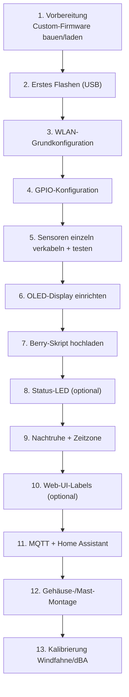
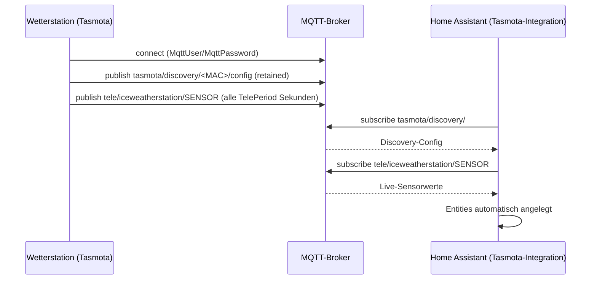

# Setup-Guide: Aufbau, Installation, Konfiguration, Integration

Schritt-für-Schritt-Anleitung für den kompletten Weg von den einzelnen Bauteilen bis zur fertig eingebundenen Wetterstation — **verifiziert am ersten real aufgebauten Gerät (Stand 2026-07-19)**. Gilt für beide Geräte — beim zweiten Gerät (ohne Home Assistant beim Empfänger) Schritt 11 überspringen.

> Platzhalter in dieser Anleitung: `<WIFI_SSID>` / `<WIFI_PASSWORT>` / `<MQTT_BROKER>` / `<MQTT_USER>` / `<MQTT_PASSWORT>` — bewusst nicht mit echten Zugangsdaten befüllt, durch eigene Werte ersetzen.



## 1. Vorbereitung

⚠️ **Wichtigste Erkenntnis aus dem realen Aufbau:** Ein Standard-Tasmota-Release reicht **nicht**, sobald sowohl AS3935 (Blitzsensor) als auch das OLED-Display gleichzeitig genutzt werden sollen — kein offizielles ESP32-Binary kombiniert beides (Details: [firmware/README.md](../firmware/README.md)). Zwei Optionen:

- **Fertig kompilierte Binaries verwenden** (schneller): [`firmware/custom-build/iceweatherstation-tasmota32.factory.bin`](../firmware/custom-build/iceweatherstation-tasmota32.factory.bin) direkt herunterladen
- **Selbst bauen** (empfohlen bei neuerer Tasmota-Version): PlatformIO-Build mit [`firmware/custom-build/user_config_override.h`](../firmware/custom-build/user_config_override.h) + optional [`friendly-labels.patch`](../firmware/custom-build/friendly-labels.patch), siehe [firmware/README.md](../firmware/README.md) für die genauen Befehle

Weiteres Werkzeug: Lötkolben, Multimeter, Wasserwaage (Regenmesser-Montage), Schraubendreher-Set, 4,7 kΩ + 10 kΩ Widerstände (DS18B20-Pullup bzw. Windfahnen-Spannungsteiler), einfaches "dummes" USB-Netzteil (**kein** Fast-Charge/PD-Ladegerät, siehe Warnung in Schritt 12).

Diese Doku griffbereit: [bom.md](bom.md) (Teile), [wiring.md](wiring.md) (Pins), [tasmota-config.md](tasmota-config.md) (Befehlsreferenz + alle live gefundenen Fallstricke), [firmware/config/backlog.txt](../firmware/config/backlog.txt) (fertiger Konsolen-Befehlssatz).

## 2. Erstes Flashen (USB)

```bash
esptool.py --chip esp32 --port /dev/ttyUSB0 --baud 460800 write_flash -z 0x0 iceweatherstation-tasmota32.factory.bin
```

Alternativ [Tasmotizer](https://github.com/tasmota/tasmotizer) (GUI), nimmt dieselbe `.factory.bin`-Datei. Nach dem ersten Boot öffnet der ESP32 einen eigenen Access Point (`tasmota-XXXX`).

## 3. WLAN-Grundkonfiguration

Über den ESP32-eigenen Access Point verbinden, dann:

```
Backlog SSID1 <WIFI_SSID>;Password1 <WIFI_PASSWORT>;WebServer 2
```

Danach ist das Gerät im eigenen WLAN unter seiner IP bzw. `http://tasmota-XXXX.local/` erreichbar.

⚠️ **Fallstrick:** Tasmota ≥15 blockt `/cm`, `/cn`, `/md` (Kommando-API, Konfigurationsseiten) standardmäßig ohne WebPassword, wenn der HTTP-Request keinen Referer-Header mitschickt (z.B. bei `curl`) — nur die reine Root-Seite `/` bleibt davon unberührt. Für Skript-/Automatisierungs-Zugriff per `curl` einen Referer-Header mitschicken: `curl -e "http://<ip>/" "http://<ip>/cm?cmnd=..."`. Alternativ dauerhaft `SetOption128 1` setzen (weniger sicher) oder ein WebPassword vergeben (empfohlen).

## 4. GPIO-Konfiguration

Empfohlen über die Web-UI (*Konfiguration → Konfiguriere Modul*) — verhindert falsch nummerierte GPIO-Komponenten-IDs, die sich zwischen Tasmota-Versionen ändern können. Alternativ per Konsole (praktisch fürs Erstflashen ohne WLAN-UI), mit den für dieses Projekt verifizierten Werten (gültig für Tasmota 15.5.0(3.3.8) — bei anderer Version per `GPIO<pin>` gegenprüfen, siehe [tasmota-config.md](tasmota-config.md) Abschnitt 2):

```
Backlog GPIO21 640;GPIO22 608;GPIO25 4672;GPIO4 1312;GPIO27 352;GPIO14 353;GPIO34 4704;GPIO35 4864
```

Zuordnung (siehe [wiring.md](wiring.md) für die physische Pin-Tabelle):

| GPIO | Rolle | Bauteil |
|---|---|---|
| 21 | I2C SDA1 | BME280 + AS3935 |
| 22 | I2C SCL1 | BME280 + AS3935 |
| 25 | AS3935 (IRQ) | AS3935 |
| 4 | DS18x201 | DS18B20 |
| 27 | Counter1 | Regenmesser |
| 14 | Counter2 | Anemometer |
| 34 | ADC Input1 | Windfahne |
| 35 | ADC Range1 | dBA-Sensor (SEN0232) |

Danach `FriendlyName1` sinnvoll setzen (z.B. „Wetterstation Schuppen“) und neustarten (`Restart 1`).

## 5. Sensoren einzeln verkabeln und testen

**Nacheinander** anschließen und nach jedem Sensor sofort prüfen — spart bei einem Fehler das Durchsuchen mehrerer gleichzeitig neuer Verkabelungen. Reihenfolge, wie am realen Gerät durchgeführt:

1. **DS18B20**: VCC/GND/DATA (siehe wiring.md) + **zwingend 4,7 kΩ Pull-up zwischen DATA und 3,3V** (ohne Pull-up bleibt der Sensor unsichtbar — kein Fehler, sondern erwartetes Verhalten eines offenen 1-Wire-Bus). Prüfen: `Status 10` → `DS18B20:{"Temperature":...}` sollte erscheinen.
2. **dBA-Sensor (SEN0232)**: DFRobot-Gravity-Kabelfarben Schwarz=GND, Rot=VCC(3,3-5V), Blau=Signal. Kalibrieren:
   ```
   AdcParam2 6,745,3226,30,130
   ```
   ⚠️ **Zwei Fallstricke:** (1) Die Kanalnummer in `AdcParam<N>` zählt nach **GPIO-Reihenfolge**, nicht nach GPIO-Nummer — bei Windfahne(34)+dBA(35) ist dBA Kanal **2**, nicht 1 (Echo-Array erste Zahl = tatsächliche GPIO-Nummer, guter Sanity-Check). (2) Die Schwellwerte sind kein Millivolt, sondern ein 0–4095-Pseudo-ADC-Wert (`mV/3300×4095`). Details: [tasmota-config.md](tasmota-config.md) Abschnitt 3.
3. **Windfahne**: Spannungsteiler mit **festem 10 kΩ-Widerstand zwischen 3,3V und GPIO34**, Windfahne selbst zwischen GPIO34-Knoten und GND. Prüfen: `Status 10` → `ANALOG:{"A1":...}`. Falls `A1` trotz korrektem GPIO nicht erscheint: `AdcParam1 6,0,0,0,0` setzen (Fallstrick: Parameter 4 ≠ 0 unterdrückt die Anzeige komplett, Details [tasmota-config.md](tasmota-config.md) Abschnitt 4).
4. **Regenmesser + Anemometer** (SEN-15901, RJ11-Pinbelegung siehe [wiring.md](wiring.md)): `CounterDebounce 10` setzen (sonst massives Kontaktprellen/Fehlzählungen). Testpulse: Reed-Kontakte per Hand kurz schließen bzw. Anemometer drehen, `COUNTER:{"C1":...,"C2":...}` sollte hochzählen.
5. **AS3935**: Auf dem CJMCU-3935-Board heißt die SDA-Leitung **„MOSI"** (kein SDA-Aufdruck), SI→3,3V, CS+MISO→GND, ggf. A0/A1→3,3V. `I2CScan` sollte `0x03` finden. Danach:
   ```
   Backlog AS3935setgain Outdoors;AS3935autonf 1;AS3935disturber 1;AS3935autodisturber 1
   ```
6. **BME280**: I2C, gemeinsamer Bus mit AS3935. `I2CScan` sollte zusätzlich `0x76`/`0x77` finden.

## 6. OLED-Display einrichten

Der klassische SSD1306-Treiber wurde in aktuellem Tasmota entfernt — das neue **uDisplay**-System braucht `DisplayModel 17` + einen virtuellen GPIO-Marker + einen Display-Descriptor. Vollständige Befehlsfolge: [tasmota-config.md](tasmota-config.md) Abschnitt 6.

## 7. Berry-Skript hochladen

*Konsole → Verwalte Dateisystem* → Datei-Upload: [firmware/berry/autoexec.be](../firmware/berry/autoexec.be) (Name **muss** exakt `autoexec.be` sein). Danach `Restart 1`. Das Skript übernimmt: Windrichtung-Umrechnung, 24h-Regenmenge, Windgeschwindigkeit, OLED-Dashboard (alle 10s), Nachtruhe-Zeitplan, sowie das Einspeisen eigener Werte in die MQTT-Telemetrie (`json_append()`).

Boot-Log auf Fehler prüfen: `BRY: Successfully loaded 'autoexec.be'` (keine `attribute_error`/`compile error`-Zeile).

## 8. Status-LED (optional)

Externe LED + 330Ω-Vorwiderstand an einem freien GPIO, z.B. GPIO2 (GPIO32 ist bereits durch den uDisplay-Marker belegt, siehe Schritt 6):

```
GPIO2 544      // "LedLink"
LedState 7     // GPIO-Rolle allein reicht NICHT, LedState zusätzlich nötig!
```

Verhalten: LED blinkt rhythmisch bei jeder MQTT-Aktivität. Details + Common-Kathode-RGB-Verkabelung (z.B. Elegoo-Kit): [tasmota-config.md](tasmota-config.md) Abschnitt 7.

## 9. Nachtruhe + Zeitzone

Zeitzone **zwingend vor** der Nachtruhe-Kontrolle prüfen — sonst rechnet die 22-08-Uhr-Logik mit falscher Lokalzeit:

```
Timezone 99
```

`Status 7` prüfen: `Local`-Zeit muss der echten Sommer-/Winterzeit entsprechen. Die Nachtruhe selbst (Display+LED 22:00–08:00 aus) ist bereits im Berry-Skript (Schritt 7) enthalten, per `QUIET_START_HOUR`/`QUIET_END_HOUR` einstellbar. Details + NTP-Boot-Race-Fallstrick: [tasmota-config.md](tasmota-config.md) Abschnitt 8+9.

## 10. Web-UI-Labels (optional)

„Counter 1“/„Analog1“/„ADC1 Range“ lassen sich nicht per Einstellung umbenennen (Tasmota-Einschränkung) — nur per Source-Patch im Custom-Build lösbar. Siehe [firmware/README.md](../firmware/README.md) Abschnitt „Optional: sprechende Web-UI-Labels“.

## 11. MQTT + Home Assistant

```
Backlog MqttHost <MQTT_BROKER>;MqttPort 1883;MqttUser <MQTT_USER>;MqttPassword <MQTT_PASSWORT>;Topic iceweatherstation;FriendlyName1 IceWeatherstation;SetOption19 1
```

⚠️ `SetOption19` aktiviert Tasmotas **eigenes** Discovery-Format (`tasmota/discovery/<MAC>/config`), nicht das generische Home-Assistant-MQTT-Schema. Für automatische Entity-Erstellung braucht HA die dedizierte **„Tasmota"-Integration** (separat von der generischen „MQTT"-Integration, beide auf derselben Verbindung). Ist diese aktiv, erscheinen Entities wie `sensor.tasmota_ds18b20_temperature` automatisch nach einem Neustart des ESP32. Details + Dashboard-Einbindung: [tasmota-config.md](tasmota-config.md) Abschnitt 10.



**Schwager-Gerät (ohne Home Assistant):** MQTT einfach unkonfiguriert lassen — das Web-UI und das OLED funktionieren komplett unabhängig davon. mDNS-Hostname (`http://tasmota-XXXX.local/`) als Lesezeichen/Homescreen-Icon speichern.

## 12. Gehäuse-/Mast-Montage

Details: [enclosure.md](enclosure.md). Kurzfassung:

1. Alle Sensoren final ins IP65-Gehäuse verkabeln (Zugentlastung an jeder Kabelverschraubung), Schraubklemmen statt Direktverlötung (leichtere Fehlersuche)
2. Mikrofonrohr (DNMS-Design) montieren, Öffnung nach unten, Schaumstoff-Windschutz einsetzen
3. Silikagel-Beutel ins Gehäuse legen
4. Anemometer/Windfahne so hoch und frei wie möglich, Regenmesser exakt waagerecht (Wasserwaage), AS3935 fern von Störquellen
5. Vor dem endgültigen Verschließen nochmal `Status 10` prüfen (alle Werte noch plausibel nach dem finalen Verkabeln?)

⚠️ **Stromversorgung — zwei Fallstricke live gefunden:**
- **Kein Spannungsteiler zur Versorgung!** Nur für Signale (Windfahne) geeignet, nicht für den ESP32 selbst (schwankender Stromverbrauch, WLAN-Spitzen bis 300–500 mA) — der 5V-Pin hat bereits einen eingebauten LDO-Regler auf 3,3V, einfach direkt anschließen.
- **Keine USB-C-Schnelllade-Netzteile (PD/QC)** — manche liefern ganz ohne Aushandlung mit einer "intelligenten" Gegenstelle keine Spannung, das Board bleibt dann komplett dunkel. Einfaches "dummes" 5V/1-2A-USB-Netzteil verwenden.

## 13. Kalibrierung nach dem Aufbau

- **Windfahne:** Rohe ADC-Werte (GPIO34, `Status 10` → `ANALOG.A1`) für jede der 16 Richtungen real messen (Kompass am Mast drehen) und die Platzhalter-Tabelle `VANE_TABLE` in [autoexec.be](../firmware/berry/autoexec.be) durch die gemessenen Werte ersetzen
- **dBA-Sensor:** Falls verfügbar, gegen ein Referenz-Schallpegelmessgerät bei 2-3 bekannten Lautstärken abgleichen
- **AS3935:** Bei häufigen Fehlalarmen (`disturber`-Events) `AS3935setnf` (Noise-Floor 0–7) nachjustieren — Outdoor-Modus reduziert das bereits deutlich

## Troubleshooting-Kurzreferenz

| Symptom | Wahrscheinliche Ursache |
|---|---|
| `I2CScan` findet BME280/AS3935/OLED nicht | Verkabelung SDA/SCL vertauscht (AS3935: Pin heißt „MOSI" nicht „SDA"), falsche I2C-Adresse, oder Board kurzzeitig ohne sauberen Neustart (I2C-Bus-Hang nach Watchdog-Reset — `Restart 1` behebt es) |
| DS18B20 liefert keinen Wert / erscheint nicht | 4,7 kΩ Pull-up fehlt zwischen DATA und 3,3V |
| `A1` (Windfahne) erscheint nicht in `Status 10` | `AdcParam1`-Parameter 4 ≠ 0 (Direct-Mode-Schalter) — auf `AdcParam1 6,0,0,0,0` zurücksetzen |
| dBA-Wert (`Range1`) unplausibel (z.B. 3,5 statt ~50-60) | Falscher `AdcParam`-Kanal (zählt nach GPIO-Reihenfolge, nicht GPIO-Nummer) oder Millivolt statt Pseudo-ADC-Wert verwendet |
| Counter1/2 zählen wild hoch ohne Bewegung | `CounterDebounce` steht auf 0 (unentprellt) — auf 10 setzen |
| `DisplayModel`/`AS3935*`-Befehle "Unknown" | Firmware ohne das jeweilige Feature — Custom-Build nötig (siehe Schritt 1) |
| `DisplayModel 2` wird lautlos auf 0 zurückgesetzt | Klassischer SSD1306-Treiber wurde entfernt — `DisplayModel 17` (uDisplay) verwenden |
| Status-LED bleibt aus trotz "LedLink"-GPIO-Rolle | `LedState` zusätzlich setzen (`LedState 7`) — GPIO-Rolle allein reicht nicht |
| Lokalzeit falsch (z.B. UTC+1 statt UTC+2 im Sommer) | `Timezone` steht nicht auf `99` |
| Display/LED gehen nach jedem Neustart kurz aus, unabhängig von der Uhrzeit | Nachtruhe-Check lief vor NTP-Sync (bereits im Skript gefixt, `tasmota.set_timer`) |
| `/cm`/`/cn`/`/md`-Aufrufe per `curl` liefern leere Antwort | Fehlender Referer-Header (Tasmota-Sicherheitsfeature) — `-e "http://<ip>/"` mitgeben |
| Board komplett dunkel (LED+OLED+alle Sensor-LEDs aus) | USB-C-Schnelllade-Netzteil liefert keine Spannung ohne Aushandlung — einfaches Netzteil verwenden |
| WLAN verbindet nicht nach Flash | ESP32 im AP-Modus (`tasmota-XXXX`) erneut verbinden, WLAN-Zugangsdaten neu eintragen |
