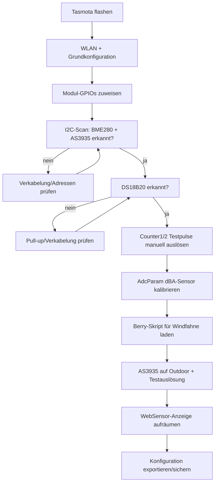

# Tasmota-Firmware-Konfiguration

> ⚠️ **Entwurfsstatus:** Diese Konfiguration ist noch nicht auf echter Hardware getestet (Teile wurden erst bestellt). Sie basiert auf offiziell dokumentierten Tasmota-Features und den Erfahrungen aus der bestehenden [Luft1-Station](https://tasmota.github.io/docs/) (baugleicher AS3935-Sensortyp, dort seit längerem stabil im Einsatz). Vor dem finalen Flashen der zweiten Station: Werte anhand der ersten, real aufgebauten Station verifizieren und diese Doku aktualisieren.

## Firmware-Basis

Kein fertiges Community-Template nötig — alle benötigten Bausteine sind in Standard-Tasmota (ESP32-Build) enthalten:

| Anforderung | Tasmota-Feature |
|---|---|
| BME280 (I2C) | Nativer Sensor-Treiber, autodetect |
| AS3935 (I2C) | Nativer Sensor-Treiber |
| DS18B20 (1-Wire) | Nativer Sensor-Treiber |
| Regen-/Windpulse | `Counter1` / `Counter2` |
| dBA-Sensor (analog, linear) | `AdcParam`-Bereichsumrechnung (Typ 6, "Range") |
| Windfahne (Potentiometer → 8 Richtungen) | Rules oder Berry-Skript (kein nativer Support) |
| Eigenes Web-UI | Berry `webserver`-Hooks |

## 1. Grundkonfiguration (Web-UI: *Konfiguration* → *Konfiguriere Modul*)

Empfohlen: Die GPIO-Zuordnung **über die Tasmota-Web-Oberfläche** vornehmen (Modul-Konfigurationsseite), nicht per handgeschriebenem `Template`-JSON — die Web-UI verhindert falsch nummerierte GPIO-Komponenten-IDs, die sich zwischen Tasmota-Versionen ändern können.

**Alternative: per Serial-Konsole (verifiziert für Tasmota 15.5.0(release-tasmota32)-3.3.8, 2026-06-22).** Statt der Web-UI kann jedes `GPIO<pin>`-Kommando direkt den numerischen Funktionswert setzen — praktisch fürs Erstflashen ohne WLAN. Die Werte wurden nicht geraten, sondern aus der `/md`-Seite dieses konkreten Builds ausgelesen (das Options-Array enthält die realen numerischen IDs):

```
GPIO21 640    // I2C SDA1 (BME280 + AS3935)
GPIO22 608    // I2C SCL1 (BME280 + AS3935)
GPIO25 4672   // AS3935 IRQ
GPIO4 1312    // DS18x20 (DS18B20-Sonde)
GPIO27 352    // Counter1 (Regenmesser)
GPIO14 353    // Counter2 (Anemometer)
GPIO34 4704   // ADC Input1 (Windfahne)
GPIO35 4864   // ADC Range1 (dBA-Sensor SEN0232)
```

⚠️ Diese Werte gelten nur für exakt diesen Firmware-Build — bei anderer Tasmota-Version vor Gebrauch per `GPIO<pin>` (ohne Wert) den aktuellen Zustand gegenprüfen bzw. neu aus `/md` auslesen. Der `/md`- und `/cn`-Pfad ist ab Tasmota ≥15 ohne WebPassword standardmäßig für Referer-lose Requests gesperrt (`HTP: Referer '' denied. Use 'SO128 1' for HTTP API`) — für den einmaligen Auslese-Zugriff testweise `SetOption128 1` setzen, danach wieder auf `0` zurücksetzen (Standard-Absicherung bleibt so erhalten).

Pinbelegung (siehe auch [wiring.md](wiring.md)):

| GPIO | Komponente |
|---|---|
| 21 | I2C SDA |
| 22 | I2C SCL |
| 25 | **AS3935** (eigene GPIO-Komponente, kein generischer Interrupt) |
| 4 | DS18B20 (1-Wire) |
| 27 | Counter1 (Regenmesser) |
| 14 | Counter2 (Anemometer) |
| 34 | ADC Input (Windfahne, Rohwert 0–4095) |
| 35 | ADC Input **Range** (dBA-Sensor SEN0232, siehe Abschnitt 3) |

> Tasmota verlangt für den AS3935 eine eigene GPIO-Rolle „AS3935" in der Modul-Konfiguration (nicht „Interrupt"). Zusätzlich müssen an der AS3935-Platine die Pins **CS und MISO auf GND**, **SI auf VCC** gelegt werden, falls die Platine diese SPI-Pins herausführt (bei I2C-Betrieb ungenutzt, aber nicht offen lassen) — [Quelle: Tasmota AS3935-Doku](https://tasmota.github.io/docs/AS3935/).

## 2. Regenmesser & Anemometer (Counter)

Tasmota zählt Pulse an `Counter1`/`Counter2` automatisch. Umrechnungsfaktoren (aus dem SparkFun-Hookup-Guide):

- **Regen:** 1 Kippe = 0,2794 mm
- **Wind:** 1 Klick/Sekunde = 1,492 mph ≈ 2,4 km/h

```
CounterType1 0        // Pulszähler, kein PWM
CounterDebounce 10     // ms, gegen Kontaktprellen am Reed-Kontakt
```

Die Umrechnung Pulse→mm bzw. Pulse/Zeit→km/h ist **nicht linear per `AdcParam` abbildbar** (zeitbasiert), deshalb im Berry-Skript berechnet — siehe [firmware/berry/autoexec.be](../firmware/berry/autoexec.be).

## 3. dBA-Sensor (SEN0232) via AdcParam (Range-Typ)

DFRobot-Formel laut Datenblatt: **dB = Vout(V) × 50** (0,6V → 30 dBA, 2,6V → 130 dBA) — exakt linear, ideal für Tasmotas native ADC-Bereichsumrechnung.

⚠️ **Zwei Fallen, live an Tasmota 15.5.0(release-tasmota32)-3.3.8 verifiziert und korrigiert (2026-07-18):**

1. **`AdcParam<N>` zählt nach GPIO-Reihenfolge, nicht nach Pin-Nummer.** Die Kanalnummer `N` entspricht der Position unter allen ADC-Rollen-Pins, aufsteigend nach GPIO-Nummer sortiert — **nicht** der GPIO-Nummer selbst. Bei diesem Projekt: GPIO34 (Windfahne, „ADC Input") ist Kanal **1**, GPIO35 (dBA, „ADC Range") ist Kanal **2** → der richtige Befehl ist `AdcParam2`, nicht `AdcParam1`! Zur Kontrolle: Der Echo-Antwort-Wert an erster Stelle im Array ist die tatsächliche GPIO-Nummer, z.B. `{"AdcParam2":[35,...]}` bestätigt Pin 35.
2. **Die Schwellwerte sind KEINE Millivolt, sondern ein 0–4095-Pseudo-ADC-Wert** (aus kalibrierter mV-Messung zurückgerechnet, siehe Tasmota-Quellcode `xsns_02_analog.ino`). 0,6V/2,6V müssen erst umgerechnet werden: `mV / 3300 × 4095`.

```
600mV  → 600/3300×4095  ≈ 745
2600mV → 2600/3300×4095 ≈ 3226

AdcParam2 6,745,3226,300,1300   // Kanal 2 = GPIO35; Pseudo-ADC 745–3226 (≈0,6–2,6V) -> Output 30,0-130,0 dBA (x0.1)
```

Ergebnis nach Korrektur: `Status 10` zeigt einen plausiblen Wert um `Range1: 500–600` (= 50–60 dBA, normaler Innenraum-Umgebungspegel), statt vorher fälschlich `35` (3,5 dBA, unmöglich niedrig — Anzeichen, dass etwas an der Umrechnung nicht stimmt).

Allgemein: mit `Status 10` immer gegenprüfen, welcher Analog-Kanal (`Range1`, `Range2`, …) tatsächlich den dBA-Wert zeigt, und mit `AdcParam<N>` (ohne Werte) den aktuell gespeicherten Zustand samt zugehöriger GPIO-Nummer abfragen, bevor man kalibriert.

## 4. Windfahne (Potentiometer → Richtung)

Keine native Tasmota-Umrechnung vorhanden. Zwei Optionen:

1. **Klassische Rules** mit ADC-Schwellwert-Vergleichen (`ON Analog#A1>x DO ... ENDON`) — einfacher, aber unübersichtlich bei 8 Richtungen mit Übergangsbereichen
2. **Berry-Skript mit Lookup-Tabelle** (empfohlen) — übersichtlicher, einfacher zu kalibrieren. Siehe [firmware/berry/autoexec.be](../firmware/berry/autoexec.be)

Die Datenblatt-Spannungswerte der SparkFun-Windfahne sind laut mehreren Quellen in der Praxis ungenau — **nach dem Aufbau mit einer Wasserwaage/Kompass real durchmessen und die Lookup-Tabelle anpassen.**

## 5. AS3935 (Blitzsensor)

Verifizierte Befehle laut [Tasmota AS3935-Dokumentation](https://tasmota.github.io/docs/AS3935/):

```
AS3935setgain Outdoors   // Outdoor-Verstärkung statt Indoors
AS3935autonf 1           // automatische Störgeräusch-Kalibrierung
AS3935disturber 1        // Disturber-Erkennung aktiv
AS3935autodisturber 1    // automatische Disturber-Unterdrückung
AS3935settings           // aktuelle Konfiguration zur Kontrolle anzeigen
```

Erfahrungswert aus der Luft1-Station: `Outdoors`-Modus ist bei Freiluft-Montage entscheidend gegen Fehlalarme (`Indoors`-Modus hat deutlich höhere, für den Außeneinsatz zu empfindliche Verstärkung). I2C-Adresse ist bei diesem Sensor-Typ fix `0x03` (kein Konfigurationsschritt nötig). Bei anhaltenden Fehlalarmen zusätzlich `AS3935setnf` (Noise-Floor-Level 0–7) manuell nachjustieren.

## 6. OLED-Display (Hailege 0,96" SSD1306, 128×64, I2C, 4-Pin)

Kein eigener GPIO nötig — das Display hängt als dritter Teilnehmer am selben I2C-Bus wie BME280 und AS3935 (siehe [wiring.md](wiring.md)). Verifiziert gegen [Tasmota Displays-Dokumentation](https://tasmota.github.io/docs/Displays/):

```
DisplayModel 2       // SSD1306
DisplayAddress 60    // 0x3C, Standardadresse der meisten SSD1306-Klone
DisplayDimmer 100    // dauerhaft an, kein Ausblenden nach Timeout
DisplayMode 0        // aktiviert DisplayText-Befehle
DisplaySize 128 64
DisplayText [x0y0f1]Wetterstation
```

⚠️ Manche Hailege-Klone laufen auf `0x3D` statt `0x3C` — vor dem `DisplayAddress`-Befehl per `I2CScan` prüfen, welche Adresse tatsächlich erkannt wird (gleiches Vorgehen wie beim AS3935-Adressabgleich). Ein separater Reset-Pin ist bei der 4-Pin-Variante (GND/VCC/SCL/SDA) nicht vorhanden und wird von Tasmota für dieses Modell auch nicht verlangt.

Sinnvoller Inhalt fürs Display: aktuelle Temperatur/Luftfeuchte (BME280), IP-Adresse, ggf. Wind/Regen-Live-Werte — Details zur Text-Platzierung (`[x,y,f]`-Syntax) in der offiziellen [Tasmota Display-Text-Doku](https://tasmota.github.io/docs/Displays/#displaytext).

## Konfigurationsablauf



Weiter mit dem [Setup-Guide](setup-guide.md) für die komplette Schritt-für-Schritt-Anleitung inklusive Home-Assistant-Einbindung.
