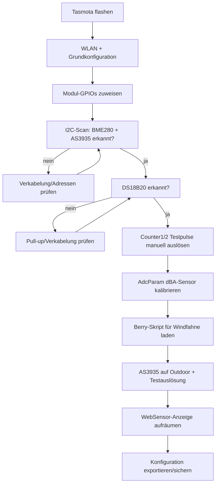
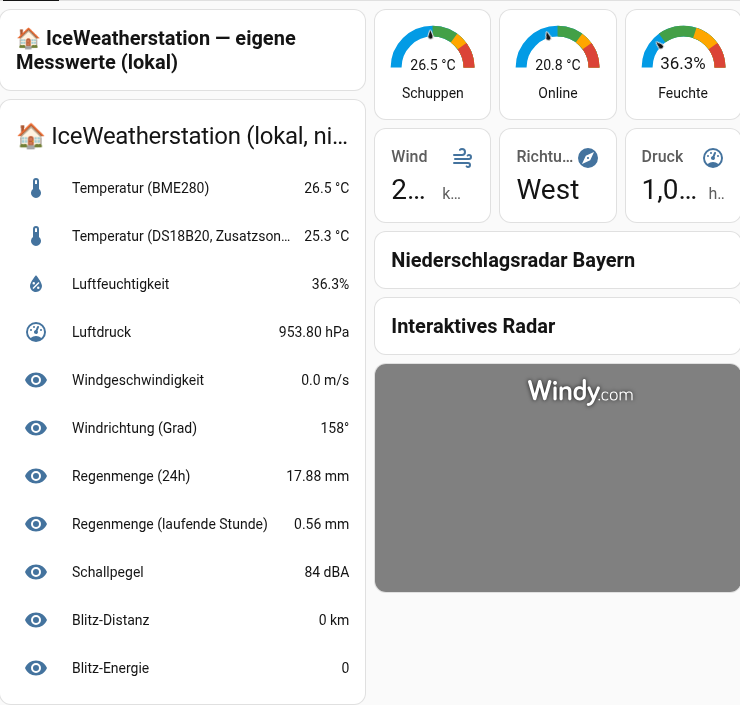

# Tasmota-Firmware-Konfiguration

> ⚠️ **Entwurfsstatus:** Diese Konfiguration ist noch nicht auf echter Hardware getestet (Teile wurden erst bestellt). Sie basiert auf offiziell dokumentierten Tasmota-Features und den Erfahrungen aus der bestehenden [Luft1-Station](https://tasmota.github.io/docs/) (baugleicher AS3935-Sensortyp, dort seit längerem stabil im Einsatz). Vor dem finalen Flashen der zweiten Station: Werte anhand der ersten, real aufgebauten Station verifizieren und diese Doku aktualisieren.

## Firmware-Basis

Kein fertiges Community-Template nötig — alle benötigten Bausteine sind in Standard-Tasmota (ESP32-Build) enthalten:

| Anforderung | Tasmota-Feature |
|---|---|
| BME280 (I2C) | Nativer Sensor-Treiber, autodetect |
| AS3935 (I2C) | Nativer Sensor-Treiber |
| DS18B20 (1-Wire) | Nativer Sensor-Treiber |
| Regen-/Windpulse | `Counter1` / `Counter2` |
| dBA-Sensor (analog, linear) | `AdcParam`-Bereichsumrechnung (Typ 6, "Range") |
| Windfahne (Potentiometer → 8 Richtungen) | Rules oder Berry-Skript (kein nativer Support) |
| Eigenes Web-UI | Berry `webserver`-Hooks |

## 1. Grundkonfiguration (Web-UI: *Konfiguration* → *Konfiguriere Modul*)

Empfohlen: Die GPIO-Zuordnung **über die Tasmota-Web-Oberfläche** vornehmen (Modul-Konfigurationsseite), nicht per handgeschriebenem `Template`-JSON — die Web-UI verhindert falsch nummerierte GPIO-Komponenten-IDs, die sich zwischen Tasmota-Versionen ändern können.

**Alternative: per Serial-Konsole (verifiziert für Tasmota 15.5.0(release-tasmota32)-3.3.8, 2026-06-22).** Statt der Web-UI kann jedes `GPIO<pin>`-Kommando direkt den numerischen Funktionswert setzen — praktisch fürs Erstflashen ohne WLAN. Die Werte wurden nicht geraten, sondern aus der `/md`-Seite dieses konkreten Builds ausgelesen (das Options-Array enthält die realen numerischen IDs):

```
GPIO21 640    // I2C SDA1 (BME280 + AS3935)
GPIO22 608    // I2C SCL1 (BME280 + AS3935)
GPIO25 4672   // AS3935 IRQ
GPIO4 1312    // DS18x20 (DS18B20-Sonde)
GPIO27 352    // Counter1 (Regenmesser)
GPIO14 353    // Counter2 (Anemometer)
GPIO34 4704   // ADC Input1 (Windfahne)
GPIO35 4864   // ADC Range1 (dBA-Sensor SEN0232)
```

⚠️ Diese Werte gelten nur für exakt diesen Firmware-Build — bei anderer Tasmota-Version vor Gebrauch per `GPIO<pin>` (ohne Wert) den aktuellen Zustand gegenprüfen bzw. neu aus `/md` auslesen. Der `/md`- und `/cn`-Pfad ist ab Tasmota ≥15 ohne WebPassword standardmäßig für Referer-lose Requests gesperrt (`HTP: Referer '' denied. Use 'SO128 1' for HTTP API`) — für den einmaligen Auslese-Zugriff testweise `SetOption128 1` setzen, danach wieder auf `0` zurücksetzen (Standard-Absicherung bleibt so erhalten).

Pinbelegung (siehe auch [wiring.md](wiring.md)):

| GPIO | Komponente |
|---|---|
| 21 | I2C SDA |
| 22 | I2C SCL |
| 25 | **AS3935** (eigene GPIO-Komponente, kein generischer Interrupt) |
| 4 | DS18B20 (1-Wire) |
| 27 | Counter1 (Regenmesser) |
| 14 | Counter2 (Anemometer) |
| 34 | ADC Input (Windfahne, Rohwert 0–4095) |
| 35 | ADC Input **Range** (dBA-Sensor SEN0232, siehe Abschnitt 3) |

> Tasmota verlangt für den AS3935 eine eigene GPIO-Rolle „AS3935" in der Modul-Konfiguration (nicht „Interrupt"). Zusätzlich müssen an der AS3935-Platine die Pins **CS und MISO auf GND**, **SI auf VCC** gelegt werden, falls die Platine diese SPI-Pins herausführt (bei I2C-Betrieb ungenutzt, aber nicht offen lassen) — [Quelle: Tasmota AS3935-Doku](https://tasmota.github.io/docs/AS3935/).

## 2. Regenmesser & Anemometer (Counter)

Tasmota zählt Pulse an `Counter1`/`Counter2` automatisch. Umrechnungsfaktoren (aus dem SparkFun-Hookup-Guide):

- **Regen:** 1 Kippe = 0,2794 mm
- **Wind:** 1 Klick/Sekunde = 1,492 mph ≈ 2,4 km/h

```
CounterType1 0        // Pulszähler, kein PWM
CounterDebounce 10     // ms, gegen Kontaktprellen am Reed-Kontakt
```

Die Umrechnung Pulse→mm bzw. Pulse/Zeit→km/h ist **nicht linear per `AdcParam` abbildbar** (zeitbasiert), deshalb im Berry-Skript berechnet — siehe [firmware/berry/autoexec.be](../firmware/berry/autoexec.be).

## 3. dBA-Sensor (SEN0232) via AdcParam (Range-Typ)

DFRobot-Formel laut Datenblatt: **dB = Vout(V) × 50** (0,6V → 30 dBA, 2,6V → 130 dBA) — exakt linear, ideal für Tasmotas native ADC-Bereichsumrechnung.

⚠️ **Zwei Fallen, live an Tasmota 15.5.0(release-tasmota32)-3.3.8 verifiziert und korrigiert (2026-07-18):**

1. **`AdcParam<N>` zählt nach GPIO-Reihenfolge, nicht nach Pin-Nummer.** Die Kanalnummer `N` entspricht der Position unter allen ADC-Rollen-Pins, aufsteigend nach GPIO-Nummer sortiert — **nicht** der GPIO-Nummer selbst. Bei diesem Projekt: GPIO34 (Windfahne, „ADC Input") ist Kanal **1**, GPIO35 (dBA, „ADC Range") ist Kanal **2** → der richtige Befehl ist `AdcParam2`, nicht `AdcParam1`! Zur Kontrolle: Der Echo-Antwort-Wert an erster Stelle im Array ist die tatsächliche GPIO-Nummer, z.B. `{"AdcParam2":[35,...]}` bestätigt Pin 35.
2. **Die Schwellwerte sind KEINE Millivolt, sondern ein 0–4095-Pseudo-ADC-Wert** (aus kalibrierter mV-Messung zurückgerechnet, siehe Tasmota-Quellcode `xsns_02_analog.ino`). 0,6V/2,6V müssen erst umgerechnet werden: `mV / 3300 × 4095`.

```
600mV  → 600/3300×4095  ≈ 745
2600mV → 2600/3300×4095 ≈ 3226

AdcParam2 6,745,3226,300,1300   // Kanal 2 = GPIO35; Pseudo-ADC 745–3226 (≈0,6–2,6V) -> Output 30,0-130,0 dBA (x0.1)
```

Ergebnis nach Korrektur: `Status 10` zeigt einen plausiblen Wert um `Range1: 500–600` (= 50–60 dBA, normaler Innenraum-Umgebungspegel), statt vorher fälschlich `35` (3,5 dBA, unmöglich niedrig — Anzeichen, dass etwas an der Umrechnung nicht stimmt).

Allgemein: mit `Status 10` immer gegenprüfen, welcher Analog-Kanal (`Range1`, `Range2`, …) tatsächlich den dBA-Wert zeigt, und mit `AdcParam<N>` (ohne Werte) den aktuell gespeicherten Zustand samt zugehöriger GPIO-Nummer abfragen, bevor man kalibriert.

## 4. Windfahne (Potentiometer → Richtung)

Keine native Tasmota-Umrechnung vorhanden. Zwei Optionen:

1. **Klassische Rules** mit ADC-Schwellwert-Vergleichen (`ON Analog#A1>x DO ... ENDON`) — einfacher, aber unübersichtlich bei 8 Richtungen mit Übergangsbereichen
2. **Berry-Skript mit Lookup-Tabelle** (empfohlen) — übersichtlicher, einfacher zu kalibrieren. Siehe [firmware/berry/autoexec.be](../firmware/berry/autoexec.be)

Die Datenblatt-Spannungswerte der SparkFun-Windfahne sind laut mehreren Quellen in der Praxis ungenau — **nach dem Aufbau mit einer Wasserwaage/Kompass real durchmessen und die Lookup-Tabelle anpassen.**

⚠️ **Fallstrick, live gefunden (2026-07-18):** Der Rohwert (`A1` im Status-10-JSON, `GPIO_ADC_INPUT`-Typ) verschwindet komplett aus der JSON-Ausgabe, sobald `AdcParam<Kanal>` den **4. Parameter ungleich 0** stehen hat (das ist Tasmotas interner Umschalter für einen "Direct Mode", der eigentlich für Dimmer/Licht-Steuerung gedacht ist, nicht für uns relevant). Falls `A1` nicht in `Status 10` auftaucht, obwohl GPIO korrekt auf „ADC Input" steht: `AdcParam<Kanal>` (Kanalnummer nach GPIO-Reihenfolge zählen, siehe Abschnitt 3) mit 4. Wert explizit auf 0 zurücksetzen, z.B. `AdcParam1 6,0,0,0,0`.

## 5. AS3935 (Blitzsensor)

Verifizierte Befehle laut [Tasmota AS3935-Dokumentation](https://tasmota.github.io/docs/AS3935/):

```
AS3935setgain Outdoors   // Outdoor-Verstärkung statt Indoors
AS3935autonf 1           // automatische Störgeräusch-Kalibrierung
AS3935disturber 1        // Disturber-Erkennung aktiv
AS3935autodisturber 1    // automatische Disturber-Unterdrückung
AS3935settings           // aktuelle Konfiguration zur Kontrolle anzeigen
```

Erfahrungswert aus der Luft1-Station: `Outdoors`-Modus ist bei Freiluft-Montage entscheidend gegen Fehlalarme (`Indoors`-Modus hat deutlich höhere, für den Außeneinsatz zu empfindliche Verstärkung). I2C-Adresse ist bei diesem Sensor-Typ fix `0x03` (kein Konfigurationsschritt nötig). Bei anhaltenden Fehlalarmen zusätzlich `AS3935setnf` (Noise-Floor-Level 0–7) manuell nachjustieren.

⚠️ **Live gefunden bei echtem Gewitter (2026-07-19):** Erstkontakt mit realem Blitzgeschehen zeigte trotz korrekt eingerichteter GPIOs durchgehend `Event:0, Distance:0, Energy:0` — Ursache war `Tunecaps:0` in `AS3935settings` (Antennen-Abstimmkondensator nie kalibriert; `0` ist hier der rohe Minimalwert, keine neutrale "kein Tuning nötig"-Einstellung). Ohne Tuning auf die geforderten 500 kHz Resonanzfrequenz sinkt die Empfindlichkeit drastisch. Fix:
```
AS3935calibrate      // "calibration failed":0 = Erfolg (0 Fehler)
AS3935disturber 1    // Kalibrierung schaltet Disturber-Filter intern ab und lässt ihn AUS zurück — danach manuell wieder anschalten!
```
Alternative laut [Tasmota-Doku](https://tasmota.github.io/docs/AS3935/): Manche Module haben den korrekten, werksseitig ermittelten Tuning-Wert als Aufkleber auf der Platine — dann direkt `AS3935settunecaps <Wert>` statt Auto-Kalibrierung. Nach jedem `AS3935calibrate`/`AS3935settunecaps` immer `AS3935settings` gegenprüfen (Disturber-Status!) und danach live abwarten, ob reale Blitze jetzt registriert werden.

## 6. OLED-Display (Hailege 0,96" SSD1306, 128×64, I2C, 4-Pin)

Kein eigener Sensor-GPIO nötig — das Display hängt als dritter Teilnehmer am selben I2C-Bus wie BME280 und AS3935 (siehe [wiring.md](wiring.md)). Braucht aber einen zusätzlichen **virtuellen Marker-Pin** (s.u.).

⚠️ **Wichtige Änderung ggü. älteren Tasmota-Anleitungen (live an Tasmota 15.5.0 verifiziert, 2026-07-18):**

1. **Der klassische `DisplayModel 2`/SSD1306-Treiber ist im Standard-`tasmota32.bin` gar nicht enthalten** — Display-Support ist ein eigenes Firmware-Feature-Build (`tasmota32-display.bin`). Umstieg per OTA, **ohne** die Sensor-Konfiguration zu verlieren (Settings bleiben auf dem separaten Flash-Dateisystem erhalten):
   ```
   OtaUrl http://ota.tasmota.com/tasmota32/release/tasmota32-display.bin
   Upgrade 1
   ```
   Läuft über den ESP32-eigenen SafeBoot-Zwischenschritt (kurzzeitig `Version 15.5.0(release-safeboot)` im Log, normal), danach automatischer Neustart in `(release-display)`. Laut Tasmota-Quellcode entfernt dieser Build nur Emulation/Domoticz/Home-Assistant/Energy-Monitoring — AS3935 und Berry bleiben erhalten.
2. **Der alte SSD1306-Treiber selbst wurde in aktuellem Tasmota komplett entfernt** und durch das neue, generische **uDisplay**-System ersetzt (`DisplayModel` ist jetzt immer **17**, unabhängig vom Displaytyp). Ein `DisplayModel 2`-Versuch wird stillschweigend auf `0` zurückgesetzt (Command scheint erfolgreich, wirkt aber nicht — keine Fehlermeldung!).

### Einrichtung (uDisplay)

1. Einen **ungenutzten** GPIO auf die Rolle **„Option A3"** setzen — rein virtueller Marker ohne physische Funktion, signalisiert Tasmota nur "uDisplay starten". In diesem Projekt: GPIO32 (frei, siehe [wiring.md](wiring.md)).
   ```
   GPIO32 6210   // "Option A3" — Basiswert "Option A1"=6208 + Instanz-Offset 2, gleiches Zählschema wie Counter1/2
   ```
2. Den SSD1306-Display-Descriptor hinterlegen — offizielle Datei [`SSD1306_128x64_display.ini`](https://github.com/arendst/Tasmota/blob/development/tasmota/displaydesc/SSD1306_128x64_display.ini) aus dem Tasmota-Repo, als **einzeiliger** String in `Rule3` gespeichert (Rule3 bewusst **nicht aktivieren** — dient hier nur als Datenspeicher für den Descriptor, nicht als ausführende Regel):
   ```
   Rule3 :H,SSD1306,128,64,1,I2C,3c,*,*,* :S,0,2,1,0,30,20 :I AE D5,80 A8,3F D3,00 40 8D,14 20,00 A1 C8 DA,12 81,9F D9,F1 DB,40 A4 A6 AF :o,AE :O,AF :A,00,10,40,00,00 :i,A6,A7
   ```
   ⚠️ Adresse `3c` im Descriptor selbst prüfen/anpassen, falls das eigene Board auf `0x3D` läuft (per `I2CScan` verifizieren, wie beim AS3935-Adressabgleich).
3. Display-Modell aktivieren und Neustart (nötig, damit der Treiber greift):
   ```
   DisplayModel 17
   Restart 1
   ```
4. Nach dem Neustart sollte das Boot-Log `DSP: SSD1306 initialized` zeigen. Test:
   ```
   DisplayText [x0y0f1]Wetterstation
   ```

### Live-Daten automatisch anzeigen

**Erster Ansatz (überholt):** Eine einfache Tasmota-Rule (`ON Tele-DS18B20#Temperature DO DisplayText ... ENDON`) reicht für einzelne Werte, aber nicht für rollierende 24h-Fenster (Regenmenge, Luftdruck-Trend) — Rules haben keinen eigenen Zustand/Speicher über die Zeit. Das finale Dashboard läuft daher komplett über [firmware/berry/autoexec.be](../firmware/berry/autoexec.be) (Berry-Skript), **Rule1 ist deaktiviert** (`Rule1 0`).

Das Skript aktualisiert alle 10 Sekunden per `tasmota.add_cron("*/10 * * * * *", ...)` vier Zeilen (Zeile 4 + Feuchte in Zeile 3 kamen erst später dazu, siehe Abschnitt 13):

```
Zeile 1: <RSSI>dBm <IP>              (oder "No-WiFi" falls WLAN nicht verbunden)
Zeile 2: <Wind m/s>M <Richtung>° <Regen 24h>L
Zeile 3: <Temperatur>C <Luftdruck ganzzahlig> <Trend U/D/-> <Feuchte>%
Zeile 4: <Regen laufende Stunde>L <Schallpegel>dBA <Blitz-Distanz>KM
```

⚠️ **ESP32 kann keine eigene Versorgungsspannung messen** (anders als ESP8266 mit `ESP.getVcc()` — keine interne Referenz zum Vergleich vorhanden, siehe [ESP32-Forum-Diskussion](https://esp32.com/viewtopic.php?t=3221)). Zeile 1 zeigt deshalb WLAN-Signalstärke statt einer erfundenen Spannungsangabe. Falls später ein Spannungsteiler an einem freien ADC-Pin (GPIO33/36/39) verbaut wird, lässt sich echte Spannungsmessung nachrüsten.

⚠️ **Font des Displays kann keine Sonderzeichen** (live getestet 2026-07-18: `°`-Zeichen erscheint als Kästchen). Das Skript hat deshalb zwei Schalter am Dateianfang:
```berry
var SHOW_DEGREE_SYMBOL = false  # testweise auf true stellen und visuell prüfen
var SHOW_TREND_ARROWS = false   # dito — Pfeile ↑/↓ vs. Buchstaben U/D
```
Nach Änderung: Datei erneut über *Konsole → Verwalte Dateisystem* hochladen (exakt `autoexec.be`) + `Restart 1`.

⚠️ Für den dBA-Sensor (`ANALOG#Range1`) empfiehlt sich `AdcParam` **ohne** die künstliche ×10-Skalierung (`AdcParam2 6,745,3226,30,130` statt `...,300,1300`) — sonst zeigt das Display "596" statt "60" an. Details zur Umrechnung: Abschnitt 3 oben.

⚠️ **Berry kennt keine Listen-Multiplikation** (`[0.0] * 24` schlägt fehl mit `attribute_error`) — Ringpuffer stattdessen per Schleife befüllen (siehe `zero_list()` im Skript).

Regenmenge/Luftdruck-Trend nutzen ein rollierendes 24-Stunden-Ringpuffer-Fenster (`tasmota.rtc()`/`tasmota.time_dump()` für die aktuelle Kalenderstunde) statt eines Mitternacht-Resets — überlebt aber **keinen Neustart** (Historie liegt im RAM, nicht in `persist`, um Flash-Verschleiß durch stündliche Schreibzugriffe zu vermeiden). Nach einem Neustart füllt sich das 24h-Fenster graduell wieder auf.

## Konfigurationsablauf



## 7. Status-LED (WLAN/MQTT-Link, optional)

Externe LED (z.B. aus einem Elegoo-Sensor-Kit) + Vorwiderstand (330Ω) an einem freien GPIO, hier **GPIO2**:

```
GPIO2 544      // "LedLink" (Basiswert "LedLink1", gleiches Zählschema wie Counter1/2)
LedState 7     // s.u. — GPIO-Rolle allein reicht NICHT aus
```

Verkabelung: GPIO → Vorwiderstand → LED-Anode (langes Beinchen), LED-Kathode (kurzes Beinchen) → GND. Bei Common-Kathode-RGB-Modulen (z.B. Elegoo SMD-RGB/RGB-LED, 4 Pins: R/G/B/GND) reicht ein einzelner Farbkanal für diesen Zweck — die anderen beiden Pins bleiben unbeschaltet.

⚠️ **Fallstrick, live gefunden (2026-07-18):** Die GPIO-Rollenzuweisung („LedLink") allein reicht nicht — ohne zusätzliches `LedState` bleibt die LED aus. `LedState` ist eine Bitmaske 0–7 (`enum LedStateOptions` im Tasmota-Quellcode: 1=Power, 2/4=MQTT-Sub/Pub-Aktivität, kombinierbar), **kein** einfacher "AN sobald WLAN+MQTT verbunden"-Schalter — eine erste Recherche deutete fälschlich auf einen (nicht existierenden) Wert 8 hin, der von `CmndLedState` aber hart auf `< MAX_LED_OPTION` (=8, also nur 0–7 gültig) begrenzt wird.

Live-Verhalten bei `LedState 7`: LED **blinkt rhythmisch bei jeder MQTT-Aktivität** (Senden/Empfangen), kein dauerhaftes Leuchten im verbundenen Zustand — zeigt damit laufende Netzwerkaktivität statt eines reinen Verbunden/Getrennt-Zustands. Für dieses Projekt genau so gewünscht (bestätigt 2026-07-18).

## 8. Zeitzone (Europe/Berlin, Sommerzeit)

⚠️ **Fallstrick, live gefunden (2026-07-18):** `TimeStd`/`TimeDst` waren bereits korrekt mit den EU-DST-Standardregeln vorbelegt (letzter Sonntag März/Oktober), trotzdem zeigte die Lokalzeit nur UTC+1 statt der im Sommer korrekten UTC+2 (CEST) — betraf nicht nur die Anzeige, sondern auch **jede zeitbasierte Logik im Berry-Skript** (24h-Ringpuffer für Regen/Luftdruck-Trend, Nachtruhe-Fenster). Ursache: `Timezone` stand nicht auf `99` (= "nutze TimeStd/TimeDst-Regeln"), sondern auf einem festen Offset ohne Sommerzeit-Umstellung. Fix:

```
Timezone 99
```

Danach `Status 7` prüfen — `"Timezone":99` und die Lokalzeit muss der tatsächlichen Sommer-/Winterzeit entsprechen (Sunrise/Sunset-Werte in der gleichen Antwort sind ein guter Plausibilitäts-Check).

## 9. Nachtruhe (Display + Status-LED 22:00–08:00 aus)

Realisiert in [firmware/berry/autoexec.be](../firmware/berry/autoexec.be) über `QUIET_START_HOUR`/`QUIET_END_HOUR` (Standard 22/8) — schaltet `DisplayDimmer` und `LedState` stündlich neu (`tasmota.add_cron("0 0 * * * *", ...)`), damit ein Neustart mitten in der Nachtruhe sich selbst korrigiert.

⚠️ **Fallstrick, live gefunden (2026-07-18):** Ein direkter Check beim Booten (in `init()`) griff auf `tasmota.rtc()['local']` zu, **bevor** NTP synchronisiert war (Epoch nahe 0 = 1970) — das lieferte Stunde 0 und löste fälschlich sofort Nachtruhe aus (Display/LED gingen nach jedem Neustart kurz aus, unabhängig von der echten Uhrzeit). Fix: `tasmota.set_timer(15000, ...)` für den ersten Check, zusätzlich Plausibilitätsprüfung (`epoch < 1000000000` → NTP noch nicht bereit → erneut in 15s versuchen).

## 10. MQTT + Home Assistant

MQTT-Zugangsdaten sind projektintern, **nicht** in diesem öffentlichen Repo dokumentiert (siehe Betriebs-Notizen). Wichtig für die HA-Anbindung:

- `SetOption19 1` aktiviert Tasmotas **eigenes** Discovery-Format unter `tasmota/discovery/<MAC>/config` — das ist **nicht** das generische `homeassistant/<component>/.../config`-Schema, das die Standard-„MQTT"-Integration in Home Assistant erwartet. Für automatische Entity-Erstellung braucht es die **dedizierte "Tasmota"-Integration** in HA (separat von der generischen MQTT-Integration, aber auf derselben MQTT-Verbindung aufbauend).
- Home Assistant erstellt Entities aus jedem Feld der periodischen `tele/.../SENSOR`-JSON automatisch (z.B. `sensor.tasmota_ds18b20_temperature`, `sensor.tasmota_counter_c1`, `sensor.tasmota_as3935_distance_2`). Eigene Berechnungswerte (Windgeschwindigkeit/-richtung, Regenmenge 24h) existieren nur im Berry-Skript-Speicher fürs OLED — damit sie ebenfalls per MQTT/HA sichtbar werden, müssen sie explizit in die SENSOR-JSON eingespeist werden.
- Dafür in der Berry-`Driver`-Klasse eine `json_append()`-Methode ergänzen (analog zu `web_sensor()`, aber für MQTT statt Web-UI):
  ```berry
  def json_append()
    tasmota.response_append(string.format(',"IceWeather":{"WindSpeed":%.2f,"WindDir":%d,"Rain24h":%.2f}',
      self.wind_ms, dir, self.rain_24h()))
  end
  ```
  Erzeugt automatisch `sensor.tasmota_iceweather_windspeed` usw. in HA, ohne HA-seitige Template-Sensoren duplizieren zu müssen.

Ergebnis im Home-Assistant-Dashboard `lovelace-wetter` (Tab „Aktuell"): eigener Kasten „🏠 IceWeatherstation (lokal, nicht online)" mit grünem Rahmen, klar von der Online-Wetterquelle (DWD/API oben im Dashboard) unterschieden.

⚠️ **Einheiten-Fallstricke, live gefunden (2026-07-19):**
- Eigene `IceWeather`-Felder (WindSpeed/WindDir/Rain24h) haben von Haus aus **keine** Einheit in HA (Tasmotas Discovery kennt nur bei bekannten Standard-Feldnamen automatisch die richtige Einheit, nicht bei selbst erfundenen JSON-Keys).
- `sensor.tasmota_as3935_distance_2` bekommt von der HA-Tasmota-Integration fälschlich die Einheit **cm** zugewiesen, obwohl der Wert tatsächlich in **km** vorliegt (Tasmotas eigenes Web-UI zeigt korrekt "km") — ein Integrations-seitiger Mapping-Fehler, nicht in Tasmota selbst behebbar.

Fix: `homeassistant: customize:`-Block in einem HA-Package (hier: `packages/iceweatherstation.yaml`, außerhalb dieses Repos in der HA-Konfiguration). Wichtig: **nicht** die neuere Per-Entity-"Anzeigeeinheit"-Option in den HA-Entity-Einstellungen verwenden — die würde bei einem `device_class: distance`-Sensor automatisch eine (hier falsche) Einheiten-Umrechnung anwenden und den ohnehin schon korrekten km-Wert nochmal verfälschen. Der klassische `customize`-Block überschreibt die Einheit nur als Label, ohne Umrechnung:
```yaml
homeassistant:
  customize:
    sensor.tasmota_as3935_distance_2:
      device_class: null   # verhindert HAs automatische Einheiten-Umrechnung
      unit_of_measurement: "km"
    sensor.tasmota_iceweather_windspeed:
      unit_of_measurement: "m/s"
    sensor.tasmota_iceweather_winddir:
      unit_of_measurement: "°"
    sensor.tasmota_iceweather_rain24h:
      unit_of_measurement: "mm"
```
Wirkt erst nach vollständigem HA-Core-Neustart oder *Entwicklertools → YAML → Alle YAML-Konfigurationen neu laden*.

## 11. Regen-24h-Ringpuffer: Persistenz über Neustarts hinweg

⚠️ **Größter funktionaler Bug, live gefunden (2026-07-19):** Der 24h-Regen-Ringpuffer (siehe Abschnitt 4 der Windfahne / [autoexec.be](../firmware/berry/autoexec.be)) lebte ursprünglich nur im RAM — **jeder Neustart löschte die komplette Regen-Historie**, nicht nur die aktuelle Stunde. Bei einem restart-anfälligen System (OTA-Updates, Watchdog-Resets, Konfigurationsänderungen — wie in diesem Projekt mehrfach erlebt) bedeutet das: Regen, der vor dem letzten Neustart fiel, fehlt in der 24h-Anzeige, obwohl er noch im 24h-Fenster liegt. Symptom: Uptime kürzer als 24h + plausibel zu niedrige Regenmenge ist ein starker Hinweis auf genau dieses Problem.

Fix: `import persist` (Tasmota-Berry-Standardmodul), Ringpuffer + Stundenmarker + Druck-Trend werden jetzt über Neustarts hinweg gespeichert. **Zwei weitere Fallstricke dabei gefunden:**

1. **`persist.foo = self.bar` mit einer Liste erzeugt KEINE gemeinsame Referenz.** Nachträgliche Änderungen an `self.bar` tauchen nicht automatisch in `persist.foo` auf — `persist.save()` schreibt dann weiterhin die alte Kopie. Fix: keine zusätzliche `self`-Kopie halten, ausschließlich direkt über `persist.rain_hourly[h] = ...` lesen/schreiben, damit es nur eine einzige Quelle der Wahrheit gibt. `persist.dirty()` zusätzlich nötig, da In-Place-Änderungen an Listen von `persist` nicht automatisch erkannt werden (nur echte Zuweisungen `persist.foo = ...` triggern das automatisch).
2. **NTP-Boot-Race betrifft nicht nur die Nachtruhe, sondern auch den Stunden-Rollover.** Direkt nach dem Booten läuft `tasmota.rtc()` kurzzeitig mit einer ungültigen Epoch (~0/1970, vor NTP-Sync) — das lieferte eine falsche "Stunde", die fälschlich einen Stundenwechsel auslöste und dabei den falschen Ringpuffer-Slot leerte (konkret beobachtet: die komplette bis dahin aufgelaufene Regenmenge wurde beim nächsten Neustart gelöscht, obwohl `persist` sie korrekt geladen hatte — der Bug schlug NACH dem Laden zu). Fix: dieselbe Epoch-Plausibilitätsprüfung (`< 1000000000` → überspringen) wie bei der Nachtruhe-Prüfung auch für `check_hour_rollover()` ergänzen.

Zusätzlich: erster Tick nach jedem Neustart setzt nur die Counter-Basiswerte (`last_counter1`/`last_counter2`), OHNE ein Delta zu berechnen — sonst würde der komplette seit dem letzten Neustart aufgelaufene Tasmota-Counter-Stand (der über manche Neustarts hinweg im RTC-Speicher erhalten bleibt) fälschlich als Regen/Wind in der ersten Sekunde nach dem Neustart gezählt.

Verifiziert per Simulation: `Counter1 <wert>` künstlich erhöhen, `Rain24h` prüfen, `Restart 1`, erneut prüfen — Wert bleibt jetzt über mehrere Neustarts hinweg korrekt erhalten.

## 12. Regen-Vibrationsunterdrückung durch den PV-Solartracker (Cross-MQTT)

⚠️ **Live gefunden (2026-07-20):** Der PV-Solartracker (`esp_solar`, [followmysun-deploy](https://github.com/) — separates Projekt) hängt im selben Schuppen wie die Wetterstation. Jede Nachführbewegung des Aktuators erzeugt genug mechanische Vibration, um am Reed-Kontakt des Regenmessers (`Counter1`) falsche Kippen auszulösen — die Bewegung "klingt" für den Reed-Kontakt wie Regen. `CounterDebounce` (Abschnitt 2) filtert nur Kontaktprellen im Millisekundenbereich, keine anhaltende Vibration über mehrere Sekunden, und `Counter1` selbst hat keine Rules-Ebene davor (reiner Hardware-Pulszähler). Ein Fix musste daher im Berry-Skript selbst ansetzen.

**Lösung:** [firmware/berry/autoexec.be](../firmware/berry/autoexec.be) abonniert per `mqtt.subscribe()` zusätzlich zwei Topics des Solartrackers auf demselben MQTT-Broker (10.10.12.100):

- `tele/solar/SENSOR` → Feld `SENSOR.Motion` (0=Stopp, 1=Hoch, 2=Runter, siehe `solar_main.py`). Bewegung aktiv → Regen-Unterdrückung bis zu einem Hard-Cap von `RAIN_SUPPRESS_MAX_S=120` s ab Bewegungsbeginn verlängern. Bewegung gestoppt → nur noch `RAIN_SUPPRESS_TAIL_S=5` s Nachlaufzeit (mechanisches Nachschwingen), dann automatisch aus.
- `tele/solar/LWT` → bei `"Offline"` die Unterdrückung sofort aufheben (Fail-Safe, falls der Tracker ausfällt/hängen bleibt, bevor er "Stopp" meldet — sonst würde die Regenmessung dauerhaft blind bleiben).

Während der Unterdrückung wird der `Counter1`-Delta **nicht** verworfen, sondern separat in `RainSuppressedMM`/`RainSuppressCount` mitgezählt (Diagnose/Tuning) — `Rain24h` bleibt unverändert. `last_counter1` wird trotzdem weitergeschrieben, damit der unterdrückte Delta nicht am Ende der Unterdrückung auf einen Schlag nachgezählt wird.

Neue Felder in der `IceWeather`-MQTT-JSON (`tele/.../SENSOR`) sowie im Tasmota-Web-UI (nur sichtbar, sobald mindestens einmal unterdrückt wurde):

```json
"IceWeather":{"WindSpeed":0.67,"WindDir":135,"Rain24h":61.19,"RainSuppressActive":0,"RainSuppressedMM":1.12,"RainSuppressCount":2}
```

Für Home Assistant empfiehlt sich ein weiterer `customize`-Eintrag analog Abschnitt 10:
```yaml
    sensor.tasmota_iceweather_rainsuppressedmm:
      unit_of_measurement: "mm"
```
⚠️ Dieser Eintrag war hier nur als Empfehlung notiert, aber nie tatsächlich in `packages/iceweatherstation.yaml` ergänzt worden — erst am 2026-07-23 nachgeholt (Anlass: `RainSuppressedMM` fehlte komplett im Dashboard, siehe Abschnitt 14), zusammen mit einer eigenen Zeile in der Entities-Karte ("Regen unterdrückt (Solartracker)").

**Verifiziert am echten Gerät (2026-07-20), per `mosquitto_pub` simulierte Tracker-Nachrichten + `Counter1 <wert>`-Testkippen:**
1. `Motion:1` per MQTT gesendet → `RainSuppressActive` wechselt sofort auf `1`.
2. Während aktiver Unterdrückung `Counter1` künstlich um 3 erhöht → `Rain24h` bleibt unverändert, `RainSuppressedMM`/`RainSuppressCount` steigen korrekt.
3. `Motion:0` gesendet, 5s Nachlaufzeit abgewartet → `RainSuppressActive` wird `0`.
4. Danach `Counter1` erneut erhöht (simuliert echten Regen) → wird wie gewohnt in `Rain24h` gezählt.
5. Fail-Safe: `tele/solar/LWT`→`"Offline"` während aktiver Unterdrückung gesendet → `RainSuppressActive` fällt sofort auf `0` (nicht erst nach 120s Hard-Cap).
6. Während der Tests startete der reale Solartracker zufällig neu und führte eine echte Nachführbewegung aus (`stat/solar/DEBUG`: `"Motor: Hoch"` → `"Motor: Stopp (overshoot)"`) — dabei stieg `RainSuppressCount` real um 1 (echte Vibrationskippe korrekt unterdrückt), `Rain24h` blieb dabei unverändert. Bestätigt die Funktion nicht nur synthetisch, sondern mit echtem Tracker-Verkehr.

⚠️ Die Testkippen (Schritte 2 und 4) haben `Rain24h`/`persist.rain_hourly` um insgesamt ca. 0,28 mm real erhöht (Schritt 4, absichtlich außerhalb des Unterdrückungsfensters ausgelöst, um die Normalzählung zu prüfen) — vernachlässigbar und läuft mit dem rollierenden 24h-Fenster von selbst wieder heraus.

## 13. OLED-Dashboard auf 4 Zeilen erweitert + weitere Werte in Home Assistant (2026-07-23)

Nach Live-Betrieb kamen zwei Fixes und eine Erweiterung dazu:

**BME280-Erkennung endgültig gefixt:** `USE_DISPLAY` aktiviert in `my_user_config.h` ungewollt auch `USE_DISPLAY_MATRIX`/`USE_DISPLAY_SEVENSEG` mit (die dort nur optisch, nicht tatsächlich per Präprozessor geguardet sind). Deren Boot-Zeit-I2C-Probe beansprucht Adresse `0x76` — identisch mit dem BME280 — und kommt ihm zuvor, sodass BME280 nie erkannt wurde (`SevenSeg found at 0x76` im Boot-Log). Fix in [`user_config_override.h`](../firmware/custom-build/user_config_override.h):
```c
#undef USE_DISPLAY_MATRIX
#undef USE_DISPLAY_SEVENSEG
```
Zusätzlich hatte das BME280-Breakout selbst einen Wackelkontakt (eine der 4 Leitungen) — sichtbar daran, dass der rohe `I2CScan` (Hardware-ACK-Ebene) den Sensor auch im stabilen Dauerbetrieb konsequent vermisste, während AS3935+OLED am selben Bus einwandfrei liefen. Nach Kontakt-Reparatur erscheint `0x76` sofort im `I2CScan` — **Tasmotas BME280-Treiber initialisiert Sensoren aber nur einmal beim Boot**, ein reiner `I2CScan` reicht danach nicht aus. Immer zusätzlich `Restart 1` senden.

**OLED-Layout erweitert** (Zeilenformat siehe Kopf-Kommentar in [autoexec.be](../firmware/berry/autoexec.be)):
```
Zeile 3: <Temperatur>C <Luftdruck> <Trend U/D/-> <Feuchte>%      (Feuchte neu)
Zeile 4: <Regen laufende Stunde>L <Schallpegel>dBA <Blitz-Distanz>KM   (komplett neu)
```
`rain_this_hour()` liest einfach `persist.rain_hourly[<aktuelle Stunde>]` aus — genau der Wert, den `check_hour_rollover()` schon laufend befüllt und erst bei Stundenwechsel zurücksetzt (Abschnitt 11), kein zusätzlicher Zustand nötig.

**Neue Werte auch in Home Assistant:** BME280-Feuchte, dBA-Schallpegel (`ANALOG.Range1`) und AS3935-Blitzdistanz waren als Standard-Tasmota-JSON-Felder bereits automatisch als eigene Entities in HA vorhanden (`sensor.tasmota_bme280_humidity`, `sensor.tasmota_analog_range1`, `sensor.tasmota_as3935_distance_2`) — nur ohne sinnvolle Einheit/Namen. Einzig `RainHour` existierte bisher nur im Berry-Skript-RAM fürs OLED; analog zu `Rain24h` (Abschnitt 10) in `json_append()` ergänzt, dadurch erscheint automatisch `sensor.tasmota_iceweather_rainhour`.

`packages/iceweatherstation.yaml` (HA-seitig, nicht in diesem Repo) um die passenden Einheiten erweitert:
```yaml
    sensor.tasmota_iceweather_rainhour:
      unit_of_measurement: "mm"
    sensor.tasmota_analog_range1:
      unit_of_measurement: "dBA"
      friendly_name: "IceWeatherstation Schallpegel"
```
Dashboard-Karte (`dashboards/wetter.yaml`, Tab „Aktuell") um BME280-Temperatur/-Feuchte/-Druck, Regen/Stunde und Schallpegel ergänzt, dritte Gauge (Feuchte) neben den beiden Temperatur-Gauges hinzugefügt, veralteten "BME280 noch nicht verbaut"-Hinweis entfernt. Ergebnis:



## 14. BME280 zeigt zu warm: Strahlungswärme statt Messfehler (2026-07-23)

Live beobachtet: BME280 zeigte zeitweise **6-8°C mehr** als der DS18B20 (z.B. 31,9°C vs. 25,1°C zur selben Sekunde). Ursache ist keine Sensor-Ungenauigkeit, sondern die **Montage**: Das BME280-Breakout sitzt direkt auf dem Prepboard an der Gehäusewand (angeklebt), die in direkter Sonneneinstrahlung steht — die Wand heizt sich auf und strahlt Wärme auf den Sensor ab. Der DS18B20 dagegen ragt als Messstift unten aus dem Gehäuse und ist nicht direkt besonnt.

⚠️ **Bewusst KEIN fixer Kalibrierungs-Offset**: Ein konstanter Korrekturwert (z.B. "BME280 minus 6,8°C") wäre nur für exakt die Sonnenbedingungen zum Messzeitpunkt richtig — nachts oder bei Bewölkung gibt es keine Strahlungswärme, ein fixer Offset würde den BME280 dann fälschlich zu kalt zeigen. Das ist ein Strahlungsschutz-Problem (fehlender Sonnenschutz/Radiation Shield), kein Kalibrierungsproblem — vergleichbar mit einem Thermometer, das man in die pralle Sonne statt in eine Wetterhütte hängt. Tasmota hat zwar einen globalen `TempOffset`-Befehl (`Settings->temp_comp`, siehe `support_command.ino`), der wirkt aber auf **alle** Temperatursensoren gleichzeitig und kann daher nicht BME280 und DS18B20 unterschiedlich korrigieren.

**Fix:** DS18B20 ist jetzt die primäre/angezeigte Lufttemperatur, sowohl auf dem OLED (Zeile 3, siehe [autoexec.be](../firmware/berry/autoexec.be)) als auch im Home-Assistant-Dashboard (`sensor.tasmota_ds18b20_temperature` zuerst gelistet + als "Schuppen"-Gauge). BME280 bleibt für Luftdruck/Luftfeuchte aktiv (davon nicht in gleichem Maß betroffen) sowie als Diagnose-Wert sichtbar, aber klar mit "Sonneneinfluss - unzuverlässig" beschriftet.

⚠️ **Nebeneffekt, im Auge zu behalten:** Die BME280-Luftfeuchte ist bei Überhitzung ebenfalls potenziell verfälscht (ein zu warmer Sensor zeigt relative Feuchte tendenziell zu niedrig) — noch nicht separat korrigiert, da schwerer zu quantifizieren als die Temperatur.

**Langfristig sauberer Fix (nicht umgesetzt, Hardware-Änderung nötig):** BME280 physisch von der Gehäusewand weg an einen beschatteten Punkt versetzen, oder einen kleinen Strahlungsschutz (z.B. einfacher weißer Trichter/Lamellenschutz) darüber montieren.

**Dashboard-Kompaktierung:** Die Entities-Karte "🏠 IceWeatherstation" hatte serienmäßig sehr große Zeilenabstände (HA bietet dafür keine native Dichte-Einstellung). Fix per `card_mod` in `dashboards/wetter.yaml`:
```yaml
card_mod:
  style: |
    #states > * {
      margin-top: -8px !important;
      margin-bottom: -8px !important;
    }
```

**Nachtrag (gleicher Tag):** Beim Durchgehen des Dashboards fiel auf, dass `RainSuppressedMM` (Regen-Vibrationsunterdrückung durch den Solartracker, Abschnitt 12) trotz existierender Entity nirgends sichtbar war — die dortige `customize`-Empfehlung war nie tatsächlich umgesetzt worden. Jetzt nachgeholt: Einheit `mm` ergänzt und als eigene Zeile "Regen unterdrückt (Solartracker)" in die Entities-Karte aufgenommen, direkt unter `RainHour`. `RainSuppressActive`/`RainSuppressCount` bewusst nicht mit aufgenommen (zu granular für die Hauptkarte, meist `0`).

Weiter mit dem [Setup-Guide](setup-guide.md) für die komplette Schritt-für-Schritt-Anleitung inklusive Home-Assistant-Einbindung.
