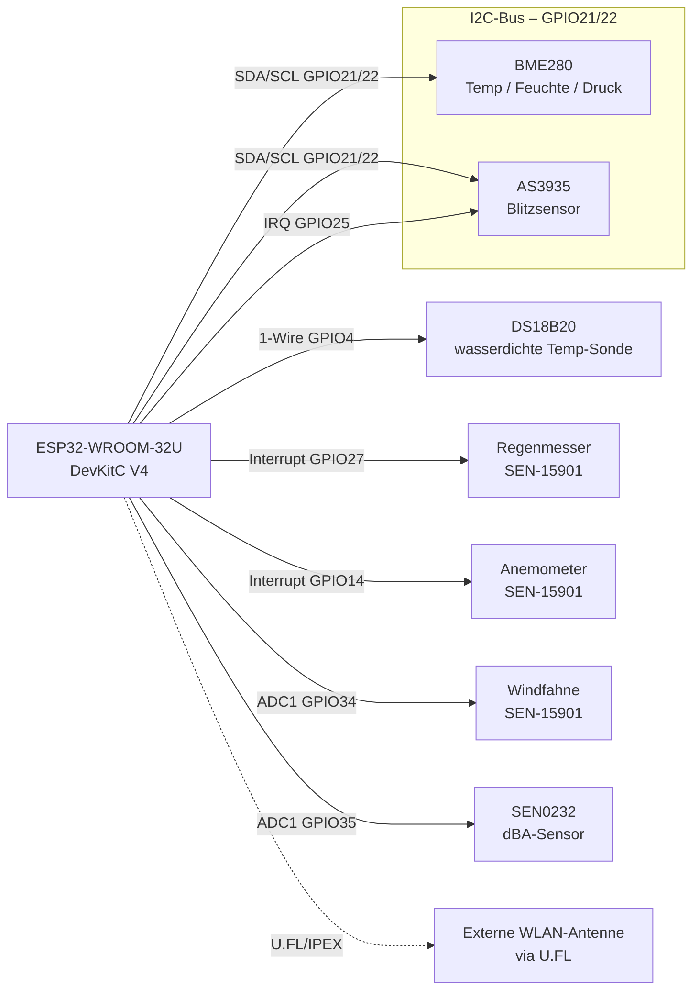
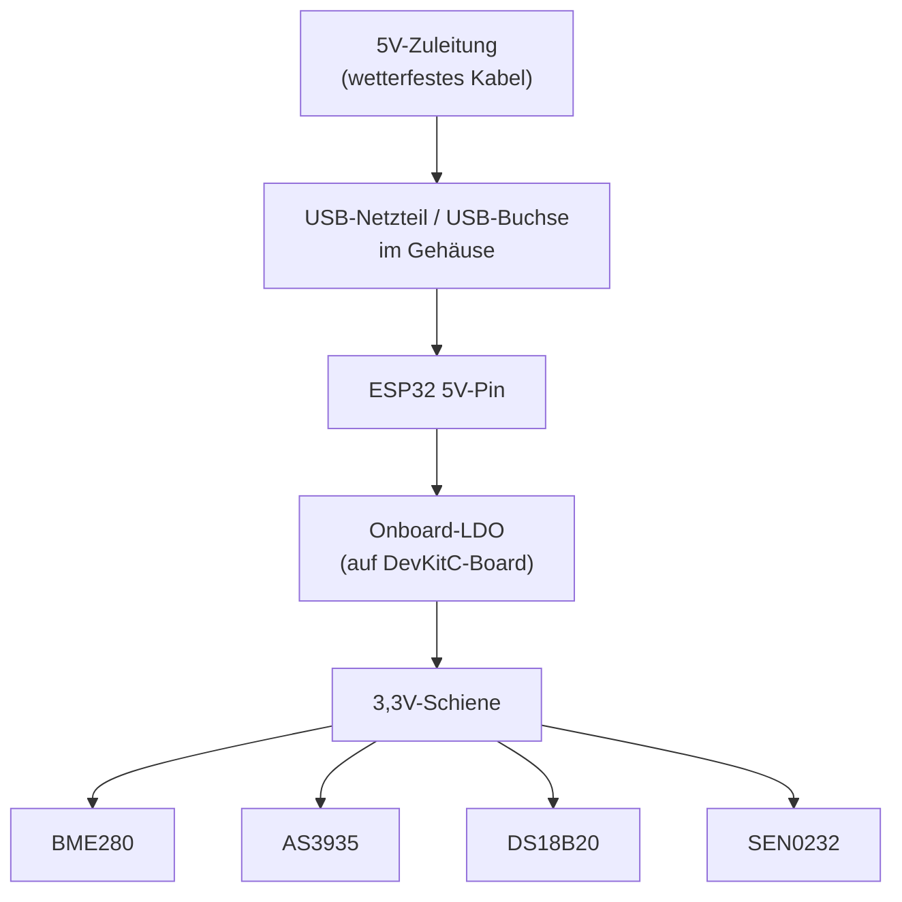

# Verkabelungskonzept

## Pin-Belegung (ESP32-WROOM-32U DevKitC V4)

| Funktion | Modulfunktion | GPIO | Typ | Hinweis |
|---|---|---|---|---|
| BME280 SDA | Thermo-/Hygro-/Barosensor (Temp/Feuchte/Druck) | 21 | I2C | gemeinsamer Bus mit AS3935 |
| BME280 SCL | Thermo-/Hygro-/Barosensor (Temp/Feuchte/Druck) | 22 | I2C | gemeinsamer Bus mit AS3935 |
| AS3935 SDA | Blitzsensor (Franklin) | 21 | I2C | gemeinsamer Bus mit BME280 |
| AS3935 SCL | Blitzsensor (Franklin) | 22 | I2C | gemeinsamer Bus mit BME280 |
| AS3935 IRQ | Blitzsensor (Franklin) | 25 | Interrupt | Blitzereignis-Trigger |
| DS18B20 | Thermosensor (wasserdicht, Zusatzmessstelle) | 4 | 1-Wire | 4,7 kΩ Pull-up gegen 3,3V |
| Regenmesser (SEN-15901) | Niederschlagsmenge | 27 | Interrupt (Counter1) | Reed-Kontakt, Kippwaage |
| Anemometer (SEN-15901) | Windgeschwindigkeit | 14 | Interrupt (Counter2) | Reed-Kontakt |
| Windfahne (SEN-15901) | Windrichtung | 34 | ADC1 | Spannungsteiler/Potentiometer |
| dBA-Sensor (SEN0232) | Schallpegel (Lautstärke, A-bewertet) | 35 | ADC1 | analoger Ausgang, 0,6–2,6V |

**Warum genau diese Pins:**
- I2C-Bus (BME280 + AS3935) bewusst auf 21/22 — Tasmota-Standardbelegung, spart Konfigurationsaufwand
- Alle ADC-Pins bewusst auf **ADC1** (GPIO32–39) — ADC2 ist bei aktivem WLAN auf dem ESP32 nicht zuverlässig nutzbar
- Rain/Wind auf getrennte Interrupt-fähige GPIOs, da beide unabhängig voneinander und potenziell gleichzeitig Pulse liefern

## Pin-Position am ESP32-WROOM-32U DevKitC V4 (Board-Beschriftung)

Der 38-Pin-DevKitC-V4-Formfaktor (Espressif-Referenzdesign, auch von den meisten Klonen inkl. 32U/32UE-Antennenvariante 1:1 übernommen) hat zwei Header-Reihen. Die aufgedruckte Zahl neben "IO"/"GPIO" **ist** die GPIO-Nummer — falls auf deinem Board nur die nackte Zahl ohne "IO"-Präfix steht, bezeichnet sie trotzdem denselben GPIO. Position wird von der 3V3-/5V-Ecke aus gezählt (siehe Pin 1/19 je Reihe):

**Linke Reihe (J2), von oben nach unten:**

| Pos. | Aufdruck | GPIO | Im Projekt verwendet |
|---|---|---|---|
| 1 | 3V3 | – | 3,3V-Versorgung (mehrfach genutzt) |
| 2 | EN | – | |
| 3 | VP | GPIO36 | |
| 4 | VN | GPIO39 | |
| 5 | IO34 | **GPIO34** | ✅ Windfahne (ADC) |
| 6 | IO35 | **GPIO35** | ✅ dBA-Sensor SEN0232 (ADC) |
| 7 | IO32 | **GPIO32** | ✅ „Option A3" — virtueller uDisplay-Marker fürs OLED, keine physische Funktion (siehe [tasmota-config.md](tasmota-config.md) Abschnitt 6) |
| 8 | IO33 | GPIO33 | |
| 9 | IO25 | **GPIO25** | ✅ AS3935 IRQ |
| 10 | IO26 | GPIO26 | |
| 11 | IO27 | **GPIO27** | ✅ Regenmesser (Counter1) |
| 12 | IO14 | **GPIO14** | ✅ Anemometer (Counter2) |
| 13 | IO12 | GPIO12 | ⚠️ Strapping-Pin, beim Booten nicht belasten |
| 14 | GND | – | |
| 15 | IO13 | GPIO13 | |
| 16 | D2 | GPIO9 | ⚠️ intern für Flash-SPI, nicht verwenden |
| 17 | D3 | GPIO10 | ⚠️ intern für Flash-SPI, nicht verwenden |
| 18 | CMD | GPIO11 | ⚠️ intern für Flash-SPI, nicht verwenden |
| 19 | 5V | – | |

**Rechte Reihe (J3), von oben nach unten:**

| Pos. | Aufdruck | GPIO | Im Projekt verwendet |
|---|---|---|---|
| 1 | GND | – | |
| 2 | IO23 | GPIO23 | |
| 3 | IO22 | **GPIO22** | ✅ I2C SCL (BME280 + AS3935) |
| 4 | TX | GPIO1 | ⚠️ Serial-Konsole, beim Flashen/Debuggen belegt |
| 5 | RX | GPIO3 | ⚠️ Serial-Konsole, beim Flashen/Debuggen belegt |
| 6 | IO21 | **GPIO21** | ✅ I2C SDA (BME280 + AS3935) |
| 7 | GND | – | |
| 8 | IO19 | GPIO19 | |
| 9 | IO18 | GPIO18 | |
| 10 | IO5 | GPIO5 | ⚠️ Strapping-Pin |
| 11 | IO17 | GPIO17 | |
| 12 | IO16 | GPIO16 | |
| 13 | IO4 | **GPIO4** | ✅ DS18B20 (1-Wire) |
| 14 | IO0 | GPIO0 | ⚠️ Boot-Strapping-Pin, nicht belegen |
| 15 | IO2 | **GPIO2** | ✅ „LedLink" — Status-LED (WLAN/MQTT-Aktivität), optional. ⚠️ zusätzlich Strapping-Pin, aber unproblematisch (siehe [tasmota-config.md](tasmota-config.md) Abschnitt 7) |
| 16 | IO15 | GPIO15 | ⚠️ Strapping-Pin |
| 17 | D1 | GPIO8 | ⚠️ intern für Flash-SPI, nicht verwenden |
| 18 | D0 | GPIO7 | ⚠️ intern für Flash-SPI, nicht verwenden |
| 19 | CLK | GPIO6 | ⚠️ intern für Flash-SPI, nicht verwenden |

**Alle 9 im Projekt genutzten GPIOs (21, 22, 25, 4, 27, 14, 34, 35, 32) liegen auf normalen, unkritischen I/O-Pins — keine Kollision mit Boot-Strapping- oder internem Flash-SPI-Pin.** Quelle: [Espressif ESP32-DevKitC V4 User Guide](https://docs.espressif.com/projects/esp-dev-kits/en/latest/esp32/esp32-devkitc/user_guide.html).

## Physische Pin-Zuordnung fürs Prep-Board

Diese Tabelle listet **jeden physischen Pin/Draht** der Bauteile und wohin er auf dem Prep-Board bzw. ESP32 gehört — als direkte Bau-Anleitung, unabhängig davon ob per RJ11-Stecker oder direkt verlötet.

| Bauteil | Modulfunktion | Bauteil-Pin/Ader | Ziel | Hinweis |
|---|---|---|---|---|
| BME280-Breakout | Thermo-/Hygro-/Barosensor | VCC | 3,3V | |
| BME280-Breakout | Thermo-/Hygro-/Barosensor | GND | GND | |
| BME280-Breakout | Thermo-/Hygro-/Barosensor | SDA | GPIO21 | gemeinsamer I2C-Bus mit AS3935 |
| BME280-Breakout | Thermo-/Hygro-/Barosensor | SCL | GPIO22 | gemeinsamer I2C-Bus mit AS3935 |
| AS3935-Modul | Blitzsensor (Franklin) | VCC | 3,3V | |
| AS3935-Modul | Blitzsensor (Franklin) | GND | GND | |
| AS3935-Modul | Blitzsensor (Franklin) | SDA (**auf CJMCU-3935 als „MOSI" beschriftet**, kein SDA-Aufdruck) | GPIO21 | gemeinsamer I2C-Bus mit BME280 |
| AS3935-Modul | Blitzsensor (Franklin) | SCL | GPIO22 | gemeinsamer I2C-Bus mit BME280 |
| AS3935-Modul | Blitzsensor (Franklin) | IRQ | GPIO25 | |
| AS3935-Modul | Blitzsensor (Franklin) | CS | GND | nur falls Platine SPI-Pins herausführt (bei I2C-Betrieb ungenutzt, aber nicht offen lassen) |
| AS3935-Modul | Blitzsensor (Franklin) | MISO | GND | s.o. |
| AS3935-Modul | Blitzsensor (Franklin) | SI | 3,3V | s.o. |
| AS3935-Modul | Blitzsensor (Franklin) | A0 / A1 (falls auf der Platine vorhanden) | 3,3V | setzt I2C-Adresse auf `0x03` (von Tasmota/Doku so erwartet) |
| DS18B20-Sonde | Thermosensor (wasserdicht, Zusatzmessstelle) | VCC (meist rot) | 3,3V | |
| DS18B20-Sonde | Thermosensor (wasserdicht, Zusatzmessstelle) | GND (meist schwarz) | GND | |
| DS18B20-Sonde | Thermosensor (wasserdicht, Zusatzmessstelle) | DATA (meist gelb) | GPIO4 | + 4,7 kΩ Pull-up zwischen DATA und 3,3V |
| SEN0232 (dBA) | Schallpegel (Lautstärke, A-bewertet) | VCC | 3,3V/5V (Modulaufdruck prüfen) | |
| SEN0232 (dBA) | Schallpegel (Lautstärke, A-bewertet) | GND | GND | |
| SEN0232 (dBA) | Schallpegel (Lautstärke, A-bewertet) | AOUT | GPIO35 | |
| SSD1306-OLED (optional) | Anzeige (Live-Werte am Gehäuse) | VCC | 3,3V | |
| SSD1306-OLED (optional) | Anzeige (Live-Werte am Gehäuse) | GND | GND | |
| SSD1306-OLED (optional) | Anzeige (Live-Werte am Gehäuse) | SDA | GPIO21 | dritter Teilnehmer am selben I2C-Bus (BME280+AS3935) |
| SSD1306-OLED (optional) | Anzeige (Live-Werte am Gehäuse) | SCL | GPIO22 | dritter Teilnehmer am selben I2C-Bus (BME280+AS3935) |
| SEN-15901 Regenmesser | Niederschlagsmenge | Ader A (Reed-Kontakt, polaritätsfrei) | GND | RJ11-Pin: siehe Tabelle unten |
| SEN-15901 Regenmesser | Niederschlagsmenge | Ader B (Reed-Kontakt, polaritätsfrei) | GPIO27 | ESP32-interner Pull-up i.d.R. ausreichend |
| SEN-15901 Anemometer | Windgeschwindigkeit | Ader A (Reed-Kontakt, polaritätsfrei) | GND | RJ11-Pin: siehe Tabelle unten |
| SEN-15901 Anemometer | Windgeschwindigkeit | Ader B (Reed-Kontakt, polaritätsfrei) | GPIO14 | ESP32-interner Pull-up i.d.R. ausreichend |
| SEN-15901 Windfahne | Windrichtung | Ader A (variabler R, polaritätsfrei) | GND | RJ11-Pin: siehe Tabelle unten |
| SEN-15901 Windfahne | Windrichtung | Ader B (variabler R, polaritätsfrei) | Spannungsteiler-Knoten → GPIO34 | zusätzlich fester Widerstand (empfohlen 10 kΩ, 1%) zwischen 3,3V und diesem Knoten nötig |

### RJ11-Pinbelegung SEN-15901 (verifiziert gegen Fine-Offset-Original-Datenblatt)

Der SEN-15901 basiert, wie in [misol-compatibility.md](misol-compatibility.md) bereits hergeleitet, auf Fine-Offset-Sensorik. Das Original-Datenblatt des Herstellers (Shenzhen Fine Offset Electronics, `DS-15901-Weather_Meter.pdf`) gibt die Pinbelegung explizit an:

| Sensor | RJ11-Kabel | Belegte Pins | Funktion |
|---|---|---|---|
| Regenmesser | eigenes, separates RJ11-Kabel | die **beiden mittleren** Kontakte | Reed-Kontakt (Schalter, kein Polaritätsbezug) |
| Anemometer | **gemeinsames** RJ11-Kabel mit Windfahne (kurzes Verbindungskabel am Sensorarm) | Pins **2 + 3** (innere Adern) | Reed-Kontakt (Schalter) |
| Windfahne | **gemeinsames** RJ11-Kabel mit Anemometer | Pins **1 + 4** (äußere Adern) | 8-Schalter/Widerstands-Netzwerk, 891 Ω–120 kΩ je nach Richtung |

> Das Datenblatt nennt keine Aderfarben (die sind laut Community-Berichten nicht über alle Fine-Offset-Klone hinweg einheitlich) — deshalb im Zweifel per Multimeter-Durchgangsprüfung gegen die Pin-Nummern verifizieren, bevor final verlötet wird.

### RJ11 entfernen und direkt aufs Prep-Board verbinden

Da alle drei SEN-15901-Sensoren reine Schalter bzw. ein reines Widerstandsnetzwerk sind (**keine Polarität**, keine aktive Elektronik), ist das Entfernen der RJ11-Stecker unkritisch:

1. RJ11-Stecker abschneiden, Kabel ca. 1–2 cm abisolieren
2. Mit Multimeter im Durchgangs-/Widerstandsmodus **die beiden Adern von Regenmesser und Anemometer/Windfahne-Gemeinschaftskabel eindeutig paaren** — wichtig ist nur, dass die beiden Adern der Windfahne nicht mit denen des Anemometers vertauscht werden (beide stecken im selben Kabel)
3. Windfahne: Probe drehen und Widerstand zwischen ihren beiden Adern messen (sollte je nach Richtung zwischen ~688 Ω und ~120 kΩ liegen, siehe Widerstandstabelle in [tasmota-config.md](tasmota-config.md)) — damit ist die Zuordnung zweifelsfrei bestätigt
4. Anemometer/Regenmesser: Adern einfach durchklingeln (Kontakt schließt beim Drehen der Becher bzw. beim Kippen der Wippe) — Polarität egal, eine Ader auf GND, andere auf den jeweiligen GPIO
5. Alle Verbindungen auf dem Prep-Board mit Schraub-/Verbindungsklemmen (siehe [bom.md](bom.md) Punkt 13) statt direkt verlöten — erleichtert spätere Fehlersuche/Austausch

Alternative ohne Auftrennen: RJ11-Buchsen (6P4C) aufs Prep-Board löten/kleben und die Original-Stecker einfach einstecken — spart das Auftrennen, braucht aber zusätzliche Buchsenteile (nicht in der BOM enthalten).

## Blockschaltbild

## Stromversorgung

**Hinweis Stromversorgung:** AS3935 und SEN0232 ziehen kontinuierlich Strom (kein reines Low-Power-Projekt). Bei der Solar-Alternative (siehe [bom.md](bom.md)) den Akku entsprechend großzügig dimensionieren.

⚠️ **Kein Spannungsteiler zur Stromversorgung verwenden!** Ein Widerstandsteiler funktioniert nur für Signale mit vernachlässigbarem Strom (wie bei der Windfahne), nicht zum Versorgen des ESP32 selbst — der zieht stark schwankenden Strom (WLAN-Sendespitzen bis 300–500 mA), ein Spannungsteiler würde dabei einbrechen (Reset-Schleifen). Der 5V-Pin des DevKitC-Boards hat bereits einen eingebauten LDO-Regler auf 3,3V — 5V-Zuleitung einfach direkt an den 5V-Pin (oder über USB).

⚠️ **Fallstrick, live gefunden (2026-07-18):** Manche moderne USB-C-Schnelllade-Netzteile (PD/QC) liefern **ganz ohne Spannung**, solange keine Aushandlung mit einer "intelligenten" Gegenstelle stattfindet — ein einfaches ESP32-Board handelt das oft nicht aus, das Board bleibt dann komplett dunkel (LED, OLED, alle Sensor-LEDs aus). Fix: einfaches "dummes" 5V/1–2A-USB-Netzteil ohne Fast-Charge/PD-Funktion verwenden (z.B. altes Handy-Ladegerät, Powerbank).

## Verkabelungs-Reihenfolge (empfohlen)

1. Erst auf dem Breadboard alle Sensoren einzeln gegen den ESP32 testen (I2C-Scan für BME280/AS3935, `OneWire`-Scan für DS18B20, ADC-Rohwerte für Windfahne/dBA), **bevor** final ins Gehäuse verlötet/verklemmt wird
2. I2C-Bus zuerst (BME280 + AS3935) — beide Adressen per `I2CScan`-Kommando in Tasmota gegenprüfen (AS3935-Klone laufen oft auf Adresse `0x03`)
3. Danach 1-Wire (DS18B20), dann die beiden Interrupt-Leitungen (Regen/Wind), zuletzt die ADC-Leitungen (Windfahne/dBA)
4. Erst nach erfolgreichem Einzeltest final ins IP65-Gehäuse verkabeln (Zugentlastung an jeder Kabelverschraubung nicht vergessen)

## Fritzing-Projektdatei

[`fritzing/IceWeatherstation.fzz`](fritzing/IceWeatherstation.fzz) — Breadboard-Verdrahtungsplan für die komplette Station (ESP32 + BME280 + AS3935 + DS18B20 + Regenmesser/Anemometer/Windfahne + dBA-Sensor + OLED + Status-LED), programmatisch aus dieser Pin-Tabelle generiert (2026-07-19).

⚠️ **Bekannte Einschränkungen (Hand-Erzeugung ohne Fritzing-GUI zur visuellen Prüfung):**
- **ESP32-WROOM-32U DevKitC V4:** echtes, community-gepflegtes Fritzing-Part ([Fritzing-Forum](https://forum.fritzing.org/t/esp32-devkitc-v4-ready/17213)), Pin-für-Pin gegen die Tabelle oben verifiziert (alle 9 im Projekt genutzten GPIOs stimmen exakt überein) — in der `.fzz` eingebettet, kein separater Download nötig.
- **BME280, DS18B20:** echte, passende Fritzing-Core-Parts (SparkFun-Breakout bzw. DS18B20-Sonde).
- **AS3935, SEN0232 (dBA), SSD1306-OLED:** Für diese drei existiert **kein** exaktes Fritzing-Part — im Bild durch elektrisch/pin-technisch passende Platzhalter-Footprints ersetzt (MPU6050/GY-521 fürs AS3935 wegen INT+I2C-Pins, TEMT6000-Breakout fürs dBA-Modul wegen VCC/GND/Signal, Grove-OLED fürs SSD1306 wegen GND/VCC/SDA/SCL) — Beschriftung im Bauteil-Titel macht das jeweils kenntlich. Optik weicht daher vom realen Bauteil ab, die Pin-Zuordnung/Verdrahtung selbst ist korrekt.
- **Regenmesser/Anemometer:** als Reed-Kontakt-Bauteil dargestellt, **Windfahne** als variabler Widerstand (2 der 3 Pins genutzt) — beides funktional exakt, wie im SEN-15901 auch tatsächlich verbaut.
- Die Netzliste (welcher Pin mit welchem verbunden ist) wurde direkt aus der obigen Tabelle erzeugt. **Update 2026-07-19:** Die Wire-Endpunkte lagen in der ersten Fassung nur grob an den Bauteil-Ecken (keine echten Pin-Koordinaten) — dadurch wirkten die Verbindungen im Breadboard-Bild "unsichtbar"/falsch platziert, obwohl die Netzliste selbst korrekt war. Fix: Pin-Positionen direkt aus den SVG-Koordinaten jedes Bauteils berechnet (Transformationskette pro Connector aufgelöst, korrekt für Rotation/Skalierung/mm-vs-Zoll), Wires liegen jetzt exakt auf den Anschluss-Pins. Bei allen 13 Bauteilen gegen die bekannten 0,1"-Pin-Raster-Abstände plausibilisiert (z.B. ESP32-Pinreihen exakt 9 Einheiten/Pin = 0,1" bei Fritzings 90dpi-Konvention).

Weiter mit: [tasmota-config.md](tasmota-config.md) für die Firmware-Seite dieser Verkabelung.
