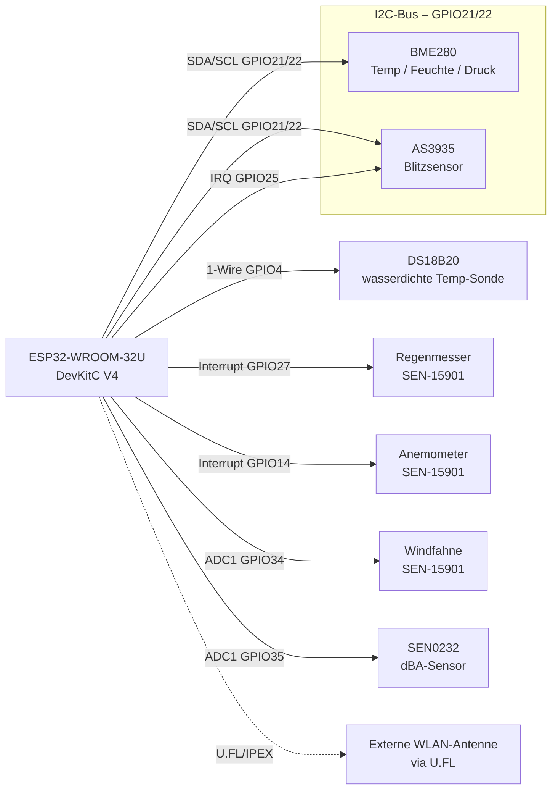
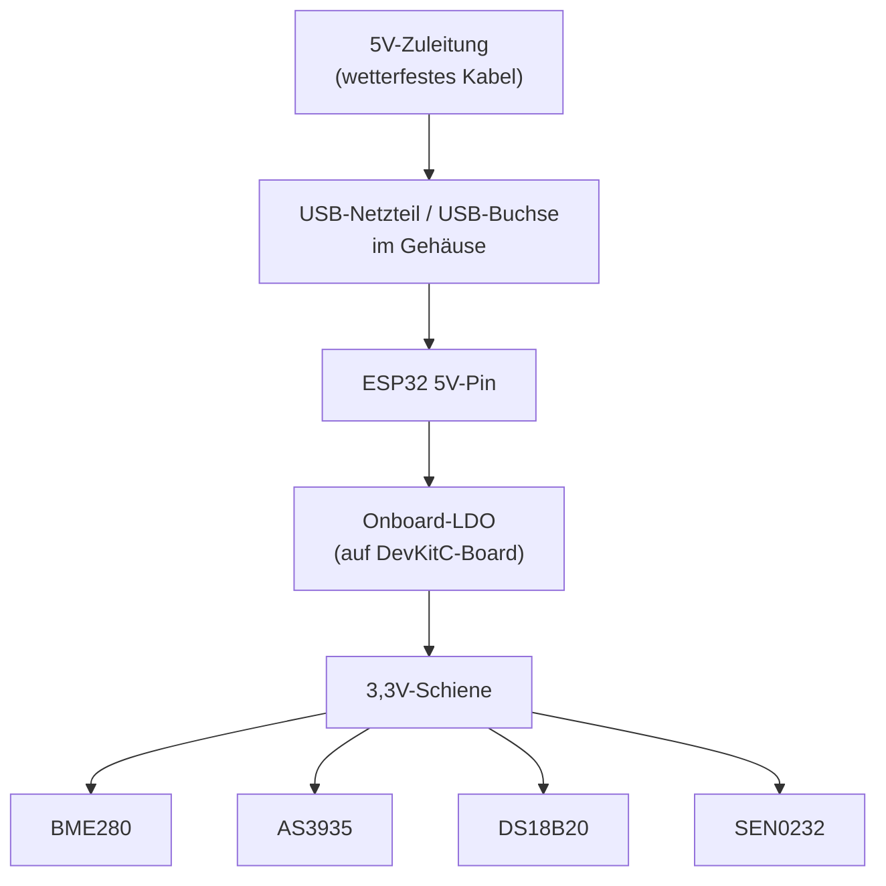

# Verkabelungskonzept

## Pin-Belegung (ESP32-WROOM-32U DevKitC V4)

| Funktion | GPIO | Typ | Hinweis |
|---|---|---|---|
| BME280 SDA | 21 | I2C | gemeinsamer Bus mit AS3935 |
| BME280 SCL | 22 | I2C | gemeinsamer Bus mit AS3935 |
| AS3935 SDA | 21 | I2C | gemeinsamer Bus mit BME280 |
| AS3935 SCL | 22 | I2C | gemeinsamer Bus mit BME280 |
| AS3935 IRQ | 25 | Interrupt | Blitzereignis-Trigger |
| DS18B20 | 4 | 1-Wire | 4,7 kΩ Pull-up gegen 3,3V |
| Regenmesser (SEN-15901) | 27 | Interrupt (Counter1) | Reed-Kontakt, Kippwaage |
| Anemometer (SEN-15901) | 14 | Interrupt (Counter2) | Reed-Kontakt |
| Windfahne (SEN-15901) | 34 | ADC1 | Spannungsteiler/Potentiometer |
| dBA-Sensor (SEN0232) | 35 | ADC1 | analoger Ausgang, 0,6–2,6V |

**Warum genau diese Pins:**
- I2C-Bus (BME280 + AS3935) bewusst auf 21/22 — Tasmota-Standardbelegung, spart Konfigurationsaufwand
- Alle ADC-Pins bewusst auf **ADC1** (GPIO32–39) — ADC2 ist bei aktivem WLAN auf dem ESP32 nicht zuverlässig nutzbar
- Rain/Wind auf getrennte Interrupt-fähige GPIOs, da beide unabhängig voneinander und potenziell gleichzeitig Pulse liefern

## Blockschaltbild

## Stromversorgung

**Hinweis Stromversorgung:** AS3935 und SEN0232 ziehen kontinuierlich Strom (kein reines Low-Power-Projekt). Bei der Solar-Alternative (siehe [bom.md](bom.md)) den Akku entsprechend großzügig dimensionieren.

## Verkabelungs-Reihenfolge (empfohlen)

1. Erst auf dem Breadboard alle Sensoren einzeln gegen den ESP32 testen (I2C-Scan für BME280/AS3935, `OneWire`-Scan für DS18B20, ADC-Rohwerte für Windfahne/dBA), **bevor** final ins Gehäuse verlötet/verklemmt wird
2. I2C-Bus zuerst (BME280 + AS3935) — beide Adressen per `I2CScan`-Kommando in Tasmota gegenprüfen (AS3935-Klone laufen oft auf Adresse `0x03`)
3. Danach 1-Wire (DS18B20), dann die beiden Interrupt-Leitungen (Regen/Wind), zuletzt die ADC-Leitungen (Windfahne/dBA)
4. Erst nach erfolgreichem Einzeltest final ins IP65-Gehäuse verkabeln (Zugentlastung an jeder Kabelverschraubung nicht vergessen)

Weiter mit: [tasmota-config.md](tasmota-config.md) für die Firmware-Seite dieser Verkabelung.
