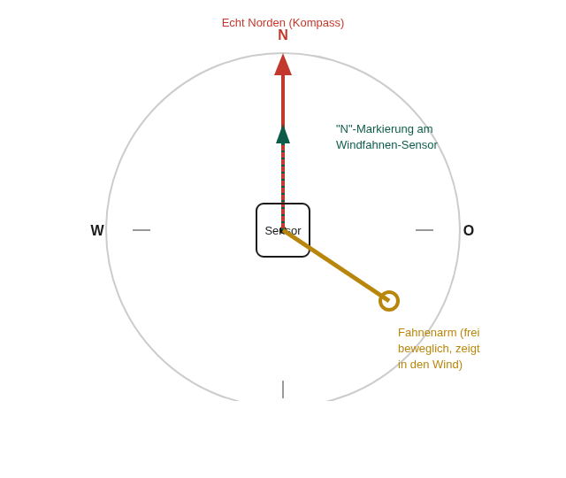

# Tasmota-Konfiguration — Stephans Version

Firmware: dieselbe Sonder-Firmware wie das Originalgerät (Tasmota 15.5.0, AS3935+OLED-Support kombiniert
— der AS3935-Treiber ist enthalten, aber ungenutzt, da kein Blitzsensor verbaut ist). Bezug/Eigenbau:
[../../firmware/README.md](../../firmware/README.md).

## 1. GPIO-Konfiguration

```
Backlog GPIO21 640;GPIO22 608;GPIO4 1312;GPIO14 352;GPIO27 353;GPIO34 4704;GPIO35 4864;GPIO32 6210;GPIO2 288
```

| GPIO | Rolle | Bauteil |
|---|---|---|
| 21 | I2C SDA1 | BME280 + OLED |
| 22 | I2C SCL1 | BME280 + OLED |
| 4 | DS18x201 | DS18B20 |
| 14 | Counter1 | Regenmesser |
| 27 | Counter2 | Anemometer |
| 34 | ADC Input1 | Windfahne |
| 35 | ADC Range1 | MQ135 (siehe Abschnitt 3 — bewusst nicht "ADC MQ") |
| 32 | Option A3 | virtueller Marker fürs OLED, kein physischer Pin |
| 2 | Led1 | Status-LED (bewusst "Led", nicht "LedLink" — siehe Abschnitt 4) |

**Hinweis:** IO14/IO27 sind hier bewusst gegenüber dem Originalgerät vertauscht (dort: 27=Regenmesser,
14=Anemometer) — passend zur tatsächlichen Verkabelung bei Stephans Aufbau. Counter1/Counter2 sind rein
softwareseitig vergebene, funktional identische Rollen; welcher physische Pin welchen Namen bekommt, ist
frei wählbar. Details zum Fund: [wiring.md](wiring.md).

Windfahne zusätzlich auf reine 1:1-Durchreichung gestellt (kein AdcParam-Range-Effekt gewünscht):

```
AdcParam1 6,0,4095,0,4095
```

MQ135 ebenso, da die Rolle "ADC Range1" ohne diesen Parameter eine eigene Skalierung anwenden würde
(mit 4 Nullen liefert sie sonst `null` statt eines Rohwerts, siehe Abschnitt 3):

```
AdcParam2 6,0,4095,0,4095
```

### Warum ein ESP32 hier zwei verschiedene ADC-Rollen braucht

Ein ESP32-Board unterstützt offenbar nur **eine** Instanz der Rolle "ADC Input" gleichzeitig — live
verifiziert: eine zweite GPIO-Zuweisung auf denselben Rollencode ersetzt die erste, statt eine zweite
Instanz zu erzeugen. Windfahne und MQ135 brauchen aber beide einen rohen 0–4095-Wert. Lösung: Windfahne
behält "ADC Input1" (IO34, JSON-Schlüssel `A1`), MQ135 nutzt stattdessen "ADC Range1" (IO35,
JSON-Schlüssel `Range1`) mit der oben gezeigten Identitäts-Skala — liefert denselben rohen Rückgabewert,
nur unter anderem Namen.

**Bekannter kosmetischer Nebeneffekt:** Die im Custom-Firmware-Build fest einkompilierten Web-UI-Labels
(`friendly-labels.patch`, ursprünglich fürs Originalgerät geschrieben) benennen die Rolle "ADC Range" fest
zu "Schallpegel...dBA" um, weil dort beim Originalgerät tatsächlich der Schallpegelsensor hängt. Da
Stephans Version keinen Schallsensor hat, zeigt diese Zeile im Web-UI den MQ135-Rohwert unter falschem
Label. Nur per Firmware-Neubau behebbar (Patch anpassen), nicht per Tasmota-Befehl. Die tatsächlich
korrekt benannte "Luftqualität"-Zeile (siehe Abschnitt 3) ist die maßgebliche Anzeige — die
"Schallpegel"-Zeile kann ignoriert werden.

## 2. Status-LED

```
LedState 0
```

Bewusst **kein** `LedState 7` (wie beim Originalgerät, das MQTT nutzt) — ohne MQTT gibt es keine
Aktivität, die Tasmotas eingebaute Blink-Logik triggern könnte. Stattdessen steuert das Dashboard-Skript
(`firmware/autoexec.be`) die LED komplett manuell über `LedPower1`, ausgelöst bei jedem Abruf der
Sensor-Tabelle (`web_sensor()`-Hook) — das passiert insbesondere bei jedem AJAX-Poll, den die
Tasmota-Startseite alle paar Sekunden ausführt, solange der Browser-Tab aktiv geöffnet ist. Ergebnis: LED
blinkt bei WLAN-Datentransfer, funktional ähnlich zum MQTT-Blinken des Originalgeräts, aber ohne
MQTT-Abhängigkeit.

**Wichtiger Fallstrick:** GPIO2 muss die Rolle **"Led"** (288) haben, nicht **"LedLink"** (544) — Letztere
hat ein eigenes, fest verdrahtetes Verbindungsstatus-Verhalten (sprang im Test selbstständig auf
`LedState 8`, "an wenn WLAN verbunden", obwohl das Skript das nirgends setzt) und überschreibt jede
manuelle Steuerung über `LedPower`. Mit der Rolle "Led" bleibt `LedState 0` stabil.

Der Blink-Puls ist auf maximal 1× pro 2 Sekunden gedrosselt (`LED_PULSE_MIN_GAP_S` im Skript) — bei
schnellerem Browser-Poll-Takt (live gemessen: teils <1s statt der angenommenen ~2,3s) würde sonst jeder
neue Aufruf den 400ms-Ausschalt-Timer des vorherigen Blitzes überholen (Tasmota ersetzt einen benannten
Timer beim erneuten Setzen) und die LED bliebe dauerhaft an statt sichtbar zu blinken.

In der Nachtruhe (22:00–08:00 Uhr) bleibt die LED unabhängig vom Traffic durchgehend aus.

## 3. MQ135-Eigenkalibrierung

Tasmotas eingebaute MQ-Sensor-Formel (`AdcParam` Typ 10, Rolle "ADC MQ") wurde getestet und über 5 Minuten
Laufzeit live beobachtet — lieferte durchgehend einen implausiblen Wert (~2,9 statt der erwarteten
Größenordnung 400–2000 ppm), unabhängig von der Uptime. Vermutete Ursache: der eingebaute Treiber geht
von einem anderen Spannungsteiler-/Referenzspannungs-Aufbau aus als unserem (10 kΩ + 15 kΩ an einem
3,3V-ADC).

Deshalb berechnet das Dashboard-Skript den ppm-Wert komplett selbst aus dem rohen ADC-Wert, nach demselben
Verfahren wie bereits produktiv laufende, baugleiche MQ135-Sensoren im eigenen Heimnetz (deren Skript als
Vorlage übernommen), aber mit dem eigenen Spannungsteiler-Verhältnis statt eines abweichenden Faktors:

```berry
var MQ_VC = 5.0              # Sensor-Versorgungsspannung (Heizer an 5V)
var MQ_DIVIDER_RATIO = 0.6   # eigener Spannungsteiler: 15k/(10k+15k)
var MQ_A = 116.6020682       # gaengige Community-Kurve fuer MQ135 (CO2-aehnlich)
var MQ_B = -2.769034857
var MQ_RATIO_CLEAN_AIR = 3.6 # Rs/Ro-Verhaeltnis in sauberer Luft
var MQ_CAL_SECONDS = 180     # Kalibrierfenster nach Boot
```

**Kalibrier-Ablauf:** in den ersten 180 Sekunden nach jedem (Neu-)Start wird die Referenz `Ro`
kontinuierlich aus der aktuellen Sensor-Resistenz `Rs` nachgeführt (setzt normale/saubere Luft in dieser
Zeit voraus), danach eingefroren. Die Web-UI zeigt währenddessen "Kalibriere.. (noch Xs)" statt einer
Kategorie. Ein Neustart mitten in verrauchter/frisch gelüfteter Luft verzerrt die Baseline dauerhaft bis
zum nächsten Neustart — bekannter Fallstrick, der bei einem baugleichen Referenzgerät im eigenen Heimnetz
einmal zu einem impliziten Fehlalarm führte.

Die CO2-Kategorie-Schwellen (übliche Innenraum-Luftqualitäts-Bänder):

| Kategorie | Bereich |
|---|---|
| Sehr gut | < 800 ppm |
| Gut | 800–1000 ppm |
| Normal | 1000–1400 ppm |
| Schlecht | 1400–2000 ppm |
| Kritisch | > 2000 ppm |

## 4. Temperatur-Kalibrierung

```
TempOffset <Differenz in °C, -12.6 bis 12.6>
```

Wirkt global auf **alle** Temperatursensoren des Geräts gleichzeitig (kein Pro-Sensor-Wert in Tasmota) —
am besten erst nach der finalen Montage im Gehäuse kalibrieren, da sich die Eigenerwärmung durch die
Elektronik je nach Position/Gehäuse unterscheidet.

## 5. Windfahnen-Kalibrierung

`VANE_TABLE` im Dashboard-Skript ist **kein Platzhalter mehr**, sondern aus dem offiziellen
Fine-Offset-Datenblatt (`DS-15901-Weather_Meter.pdf`, Hersteller der SEN-15901-Sensorik) berechnet:
Datenblatt-Tabelle "Direction/Resistance" (16 Werte, 891 Ω–120 kΩ) durch die Spannungsteiler-Formel
`raw = 4095 * Rvane / (10000 + Rvane)` in erwartete rohe ADC-Werte umgerechnet — passend zu unserem
eigenen 10-kΩ-Spannungsteiler an 3,3V, identische Topologie wie im Datenblatt-Beispielschaltbild.

Dadurch reduziert sich die Kalibrierung auf einen rein **mechanischen** Schritt: beim Mastmontage die
"N"-Markierung auf dem Windfahnen-Sensor selbst nach echt Norden ausrichten. Kein Software-Abgleich, kein
Kompass-Offset im Skript mehr nötig — die Tabelle stimmt bereits mit echten Kompassrichtungen überein,
sofern die Fahne korrekt ausgerichtet montiert wird.



### Ausrichtungsprozedur bei der Montage

1. Windfahne auf ihre Achse/Lager montieren (noch nicht endgültig fixieren)
2. Kompass (echtes Gerät oder Handy-App) direkt daneben halten, echt Norden bestimmen
3. Sensorgehäuse so drehen, dass seine **"N"-Markierung** exakt nach Norden zeigt
4. Erst jetzt endgültig festschrauben/fixieren

**Wichtig — live gefunden (09.08.2026):** Eine Kompass-Gegenprobe funktioniert nur zuverlässig, wenn die
Fahne **fest auf ihrer Achse montiert** ist und frei in ihre 16 Rastpositionen einrasten kann. Von Hand
gehalten (z.B. zum schnellen Test auf dem Tisch) liefert der Rohwert keine eindeutigen Ergebnisse — die
Fahne trifft dabei praktisch nie exakt eine der festen Magnet-Positionen, sondern oft eine uneindeutige
Zwischenstellung (laut Datenblatt das Resultat zweier gleichzeitig aktiver Schalter). Getestet mit zwei
Handhaltungen (Norden, Süden): beide ergaben Rohwerte, die keiner sauberen 180°-Beziehung in der Tabelle
entsprachen — kein Defekt, sondern erwartetes Verhalten einer nicht fest montierten Fahne.

Optionale Gegenprobe **nach fester Montage**: `Status 10` → `ANALOG.A1` mit der Fahne in eine bekannte
Richtung gedreht abfragen und mit der Tabelle vergleichen.

## 6. WLAN-Setup vor Übergabe erneut aktivieren

**Das ist der letzte Software-Schritt, bevor das Gehäuse verschlossen und an Stephan übergeben wird** —
danach ist das Gerät nicht mehr über das Test-WLAN erreichbar.

Um wieder in den Ersteinrichtungs-Zustand (eigener Access Point + WLAN-Auswahl) zu wechseln, ohne
GPIOs/Skript/Kalibrierung zu verlieren, in der Konsole (oder per `cm?cmnd=`):

```
WifiConfig 2
```

Startet sofort den WiFi-Manager: Gerät öffnet für 3 Minuten seinen eigenen Access Point (Name z.B.
`tasmota-XXXXXX`) mit Setup-Portal inkl. WLAN-Netzwerkauswahl — genau der Zustand nach dem Erstflashen.
Passiert in den 3 Minuten nichts, verbindet sich das Gerät danach automatisch wieder mit dem zuletzt
bekannten Netz (in dem Fall `WifiConfig 2` einfach erneut ausführen). Ein bloßes Löschen der SSID
(`SSID1 0`) reicht laut Tasmota-Dokumentation nicht zuverlässig, um den AP-Modus auszulösen —
`WifiConfig 2` ist der zuverlässige Weg.

**Für Stephan** (siehe [Bauanleitung](bauanleitung.pdf) Abschnitt 6): Nach `WifiConfig 2` verbindet er sich
mit dem geöffneten Access Point und trägt dort sein eigenes WLAN ein — danach ist das Gerät dauerhaft in
seinem Netz.

## 7. Kein MQTT

Bewusst nicht konfiguriert — Stephans Standort hat keine Home-Assistant-Instanz, alle Werte laufen über
die Tasmota-eigene Weboberfläche.

## 8. OLED-Anzeige — Bedeutung der vier Zeilen

Das Display zeigt die wichtigsten Kernwerte direkt am Gehäuse, auch ohne Handy/Browser in der Nähe.
Format (aus `refresh_display()` in `autoexec.be`):

| Zeile | Beispiel | Bedeutung |
|---|---|---|
| 1 | `-58dBm 192.168.1.42` | WLAN-Signalstärke (negativ, näher an 0 = besser; ab ca. -80 dBm wird's wacklig) + aktuelle IP-Adresse. Zeigt `No-WiFi`, wenn die WLAN-Verbindung gerade fehlt. |
| 2 | `2M 270° 3L` | **M** = Windgeschwindigkeit in m/s. **°** = Windrichtung in Grad wie am Kompass (0°/360°=Nord, 90°=Ost, 180°=Süd, 270°=West), im Uhrzeigersinn. **L** = Regenmenge der letzten 24h in Liter/m² — entspricht "mm Niederschlag" (1 mm Regen = 1 L/m²), nur anders benannt, kein Fehler. |
| 3 | `21.4C 1013 U 55%` | Temperatur in °C (vom DS18B20, bewusst nicht vom BME280 — Eigenerwärmungseffekt, siehe Abschnitt 4), Luftdruck in hPa (gerundet), Drucktrend (**U**p/**D**own/**-** = stabil), Luftfeuchte in % (vom BME280). |
| 4 | `Regen Stunde: 0.2L` | Regenmenge der aktuell laufenden Stunde, gleiche Einheit wie Zeile 2 (L = L/m² = mm). Setzt sich stündlich automatisch zurück. |

Nachts (22:00–08:00 Uhr, siehe `QUIET_START_HOUR`/`QUIET_END_HOUR`) bleiben Display und Status-LED
bewusst aus, um nicht zu stören — kein Fehler.

Weiter mit: [wiring.md](wiring.md) für die physische Verkabelung.
