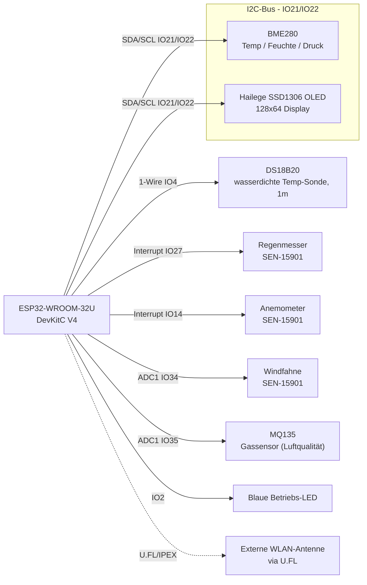
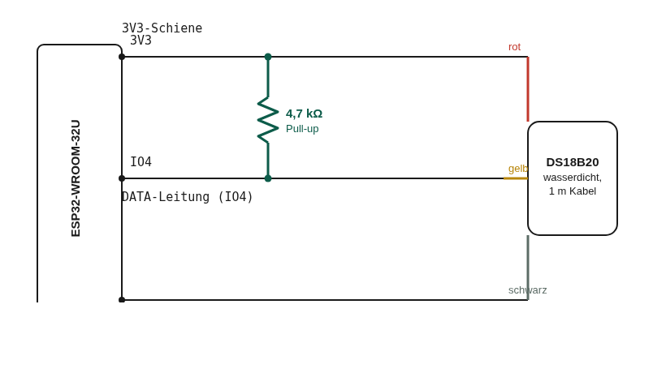
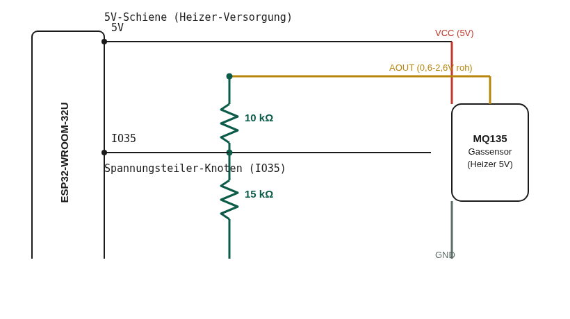
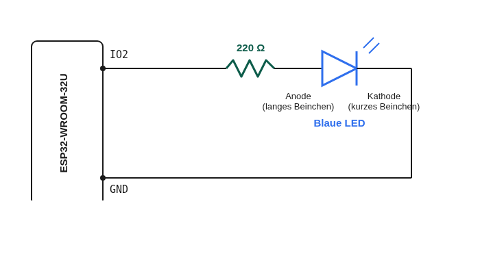

# Verkabelung — Stephans Version

Alle Pin-Angaben nutzen die Beschriftung, wie sie direkt auf dem ESP32-WROOM-32U-DevKitC-V4-Board
aufgedruckt ist (z.B. `IO21`) — keine Umrechnung von GPIO-Nummern nötig. Vollständige Pin-Positionstabelle
(welcher Aufdruck an welcher physischen Stelle sitzt): [../../docs/wiring.md](../../docs/wiring.md)
(Originalgerät-Doku, Abschnitt "Pin-Position am ESP32-WROOM-32U DevKitC V4").

## Blockschaltbild

## Pin-Tabelle

| Bauteil | Pin/Ader | Board-Pin | Hinweis |
|---|---|---|---|
| BME280 | VCC | 3V3 | |
| BME280 | GND | GND | |
| BME280 | SDA | IO21 | gemeinsamer I2C-Bus mit OLED |
| BME280 | SCL | IO22 | gemeinsamer I2C-Bus mit OLED |
| Hailege OLED | VCC | 3V3 | |
| Hailege OLED | GND | GND | |
| Hailege OLED | SDA | IO21 | dritter Teilnehmer am selben I2C-Bus |
| Hailege OLED | SCL | IO22 | dritter Teilnehmer am selben I2C-Bus |
| DS18B20 | VCC (meist rot) | 3V3 | |
| DS18B20 | GND (meist schwarz) | GND | |
| DS18B20 | DATA (meist gelb) | IO4 | + 4,7 kΩ Pull-up zwischen DATA und 3V3 (zwingend) |
| Blaue Status-LED | Anode (langes Beinchen) über 220 Ω-Vorwiderstand | IO2 | |
| Blaue Status-LED | Kathode (kurzes Beinchen) | GND | |
| SEN-15901 Regenmesser | Ader A (Reed-Kontakt, polaritätsfrei) | GND | kein Widerstand nötig |
| SEN-15901 Regenmesser | Ader B | IO27 | |
| SEN-15901 Anemometer | Ader A (Reed-Kontakt, polaritätsfrei) | GND | kein Widerstand nötig |
| SEN-15901 Anemometer | Ader B | IO14 | |
| SEN-15901 Windfahne | Ader A (variabler Widerstand, polaritätsfrei) | GND | |
| SEN-15901 Windfahne | Ader B | Spannungsteiler-Knoten → IO34 | + fester 10 kΩ-Widerstand zwischen 3V3 und diesem Knoten |
| MQ135 | VCC (Heizer) | **5V** (nicht 3V3!) | Heizer zieht durchgehend ~150–200 mA |
| MQ135 | GND | GND | |
| MQ135 | AOUT | Spannungsteiler-Knoten → IO35 | + 10 kΩ (AOUT→Knoten) und 15 kΩ (Knoten→GND) |

**Wichtig — welche Sensoren brauchen einen Widerstand:** Nur Bauteile mit einem *variablen* Ausgang
(Windfahne, MQ135) brauchen einen Spannungsteiler. Regenmesser und Anemometer sind reine Reed-Kontakt-
Schalter (an/aus) — die nutzt den internen Pull-up des ESP32, kein externer Widerstand nötig.

## Schaltbilder

### DS18B20 Pull-up

Der 4,7-kΩ-Widerstand überbrückt **3V3 und die DATA-Leitung** als eigene, dritte Verbindung — zusätzlich
zum normalen dreiadrigen Sensorkabel. 1-Wire-Busse wie beim DS18B20 haben keinen aktiven Treiber, der die
Leitung auf HIGH zieht: ohne den Widerstand "floatet" IO4 (kein definierter Pegel), sobald niemand gerade
sendet, und der Sensor bleibt beim Scan unsichtbar — kein Defekt, sondern erwartetes Verhalten eines
offenen Busses.

### MQ135-Spannungsteiler

Reduziert den 0–5V-Rohausgang des Sensors auf den 0–3,3V-Bereich, den der ESP32-ADC verträgt: 10 kΩ
zwischen AOUT und dem IO35-Messknoten, 15 kΩ zwischen diesem Knoten und GND.

### Status-LED

Einfache Einzel-LED mit Vorwiderstand, keine Besonderheiten in der Verkabelung selbst — die Software-Seite
(GPIO-Rolle, Blink-Logik) ist in [tasmota-config.md](tasmota-config.md) dokumentiert.

## RJ11-Pinbelegung SEN-15901

| Sensor | Kabel | Belegte Pins | Funktion |
|---|---|---|---|
| Regenmesser | eigenes, separates Kabel | die beiden mittleren Kontakte | Reed-Kontakt (Schalter) |
| Anemometer | gemeinsames Kabel mit Windfahne | Pins 2+3 (innere Adern) | Reed-Kontakt (Schalter) |
| Windfahne | gemeinsames Kabel mit Anemometer | Pins 1+4 (äußere Adern) | 8-Stufen-Widerstandsnetzwerk, 891 Ω–120 kΩ |

Aderfarben sind nicht herstellerübergreifend einheitlich — im Zweifel per Multimeter gegen die
Pin-Nummern verifizieren, bevor final verlötet wird. Details zum Original-Datenblatt (Shenzhen Fine
Offset Electronics): [../../docs/wiring.md](../../docs/wiring.md).

## Widerstandsliste (Zusammenfassung)

| Widerstand | Zweck | Position |
|---|---|---|
| 4,7 kΩ | DS18B20 1-Wire Pull-up | zwischen IO4 und 3V3 |
| 10 kΩ | Windfahnen-Spannungsteiler | zwischen 3V3 und IO34-Knoten |
| 10 kΩ | MQ135-Spannungsteiler (oberer Teil) | zwischen MQ135-AOUT und IO35-Knoten |
| 15 kΩ | MQ135-Spannungsteiler (unterer Teil) | zwischen IO35-Knoten und GND |
| 220 Ω | LED-Vorwiderstand | zwischen IO2 und LED-Anode |

## Live gefundener Fallstrick: Wackelkontakt am Windfahnen-Knoten

Beim Aufbau zeigte der Windfahnen-Rohwert (`ANALOG.A1`) einen ständig schwankenden Wert (z.B.
188→245→184), obwohl die Fahne stillstand — auch nachdem ein externer Störfaktor (ein in der Nähe
drehendes Anemometer) ausgeschlossen wurde. Ursache war ein loser Kontakt am Spannungsteiler-Knoten
(Widerstand-Beinchen bzw. Windfahnen-Ader nicht fest genug verbunden). Nach dem Nachdrücken aller drei
Verbindungen an diesem Knoten stand der Wert bei konstanter Ausrichtung felsenfest. Symptom-Erkennung:
ein *stillstehender* Sensor sollte einen *stabilen* Rohwert liefern — deutliches, unregelmäßiges
Schwanken deutet auf einen losen Kontakt, nicht auf einen defekten Sensor.

Weiter mit: [tasmota-config.md](tasmota-config.md) für die Firmware-Konfiguration.
